# ISS TLE Observations

This repo contains a list of images showing Transient [Luminous Events (TLEs)](https://en.wikipedia.org/wiki/Upper-atmospheric_lightning) captured from the International Space Station (ISS).

## Image processing

All images in this repository were processed with Adobe Lightroom with very similar settings to make them more appealing to look at, but still keep a very consistent appearance:

* Color profile: `Adobe Color`
* Whitebalance set to `Daylight` or alternatively moonlit clouds in the scene
* `Exposure`, `Shadows`, `Highlights`, etc. slightly adjusted to show fully dynamic range
* Noise reduction: [Lightroom AI denoise](https://blog.adobe.com/en/publish/2023/04/18/denoise-demystified) at 10-20% strength, sometimes also traditional denoise
* Lens corrections: Vignette correction, No distortion correction (causes fringes on noisy images)

## Attribution

For usage of original NASA images please refer to: <https://eol.jsc.nasa.gov/FAQ/#Couoap>
> For astronaut photography of Earth accessed through this website, please state “Image courtesy of the Earth Science and Remote Sensing Unit, NASA Johnson Space Center" [...], NASA Johnson Space Center" as appropriate. We recommend that the caption or supporting materials used for any photograph published include the unique photo number (Mission-Roll-Frame), and our website (eol.jsc.nasa.gov) so that others can locate or obtain copies when needed. [...]

Reprocessed images from this repository or the Flickr album should additionally acknowledge: `Processing: Simeon Schmauß CC-BY 4.0`

## How to contribute

If you find TLE images on <https://eol.jsc.nasa.gov> which are not yet on the list, you can contribute them in two ways:

* Send me a message on [Bluesky](https://bsky.app/profile/stim3on.bsky.social) or [Mastodon](https://fosstodon.org/@stim3on) or [Email](mailto:simeon[dot]schmauss[at]hm.edu)
* Open an [Issue](https://github.com/sschmaus/ISS_TLE_observations/issues/new?title=New%20TLE%20observation&body=The%20following%20Astronaut%20image[s]%20contain%20TLEs,%20please%20add%20them%20to%20the%20repository:) with the NASA image id or link

## Acknowledgements

This list of TLE observations was compiled from various sources:

* Manual search on <https://eol.jsc.nasa.gov>
* [Jehl et al., “Color Pictures of Sprites from Non-Dedicated Observation on Board the International Space Station.”](https://doi.org/10.1029/2012JA018144)
* Social media posts from Astronauts
* Riccardo Rossi and the [AstronautiCAST](https://www.youtube.com/@astronauticast) YouTube channel

## Table of observations

This table is also available in machine readable form as [TLE_observations.csv](TLE_observations.csv)

| Photo Number | Processed crop | Processed full | Info | Download |
|--------------|----------------|----------------|------|----------|
| [ISS028-E-31144](https://eol.jsc.nasa.gov/SearchPhotos/photo.pl?mission=ISS028&roll=E&frame=31144 "Link to the image listing") | [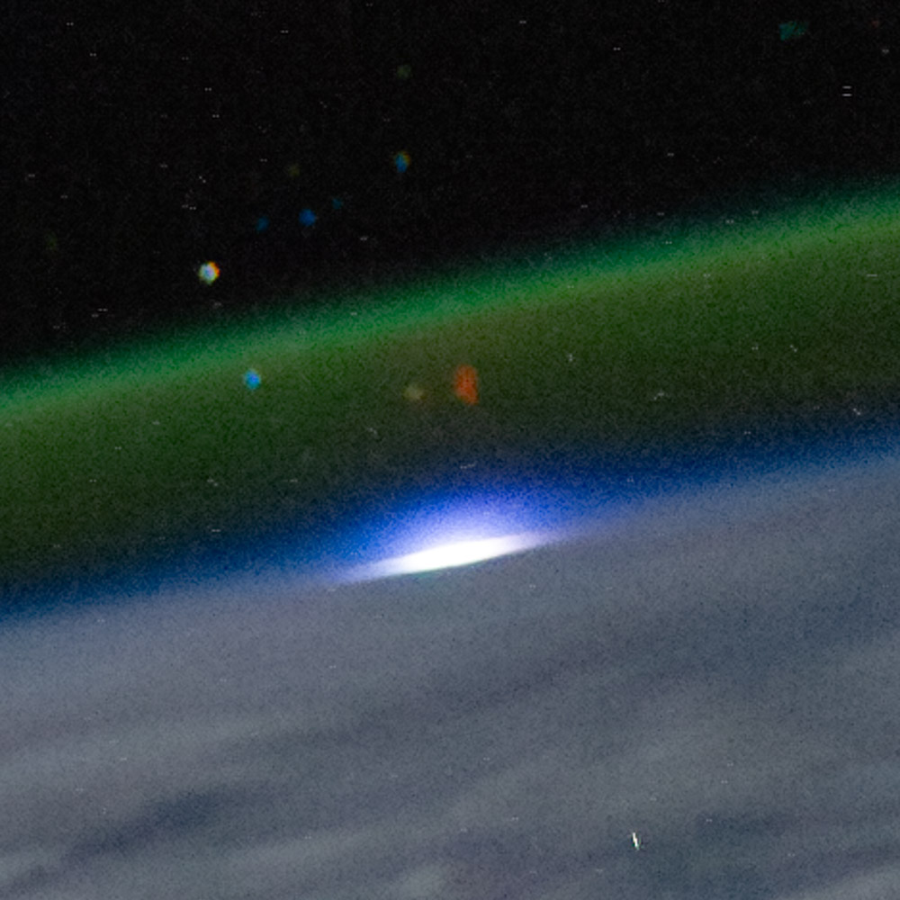](thumbnails/crop/iss028e031144.jpg "Full resolution will be uploaded to Flickr") | [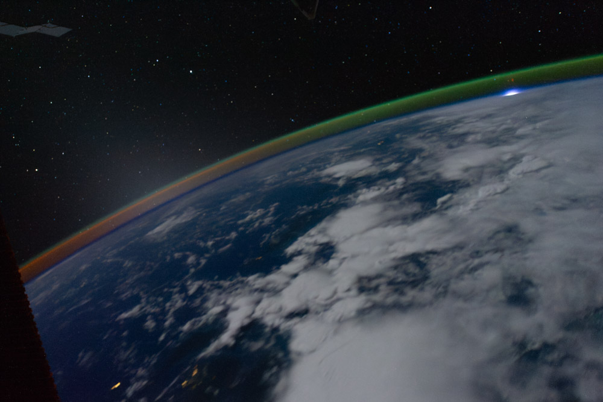](thumbnails/edit/iss028e031144.jpg "Full resolution will be uploaded to Flickr") | TLE Type: sprite    Astronaut: *Unknown* | [Full resolution](https://eol.jsc.nasa.gov/DatabaseImages/ESC/large/ISS028/ISS028-E-31144.JPG)    [Request Raw](https://eol.jsc.nasa.gov/SearchPhotos/RequestOriginalImage.pl?mission=ISS028&roll=E&frame=031144&file=iss028e031144.NEF) |
| [ISS029-E-28787](https://eol.jsc.nasa.gov/SearchPhotos/photo.pl?mission=ISS029&roll=E&frame=28787 "Link to the image listing") | [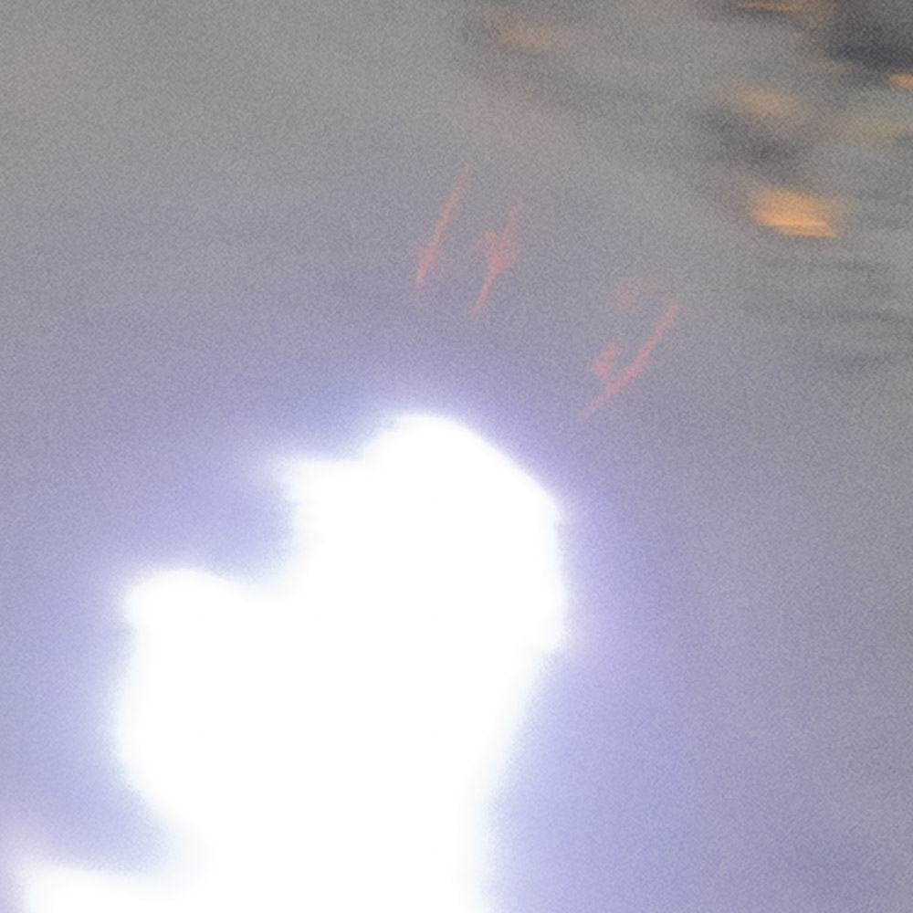](thumbnails/crop/iss029e028787.jpg "Full resolution will be uploaded to Flickr") | [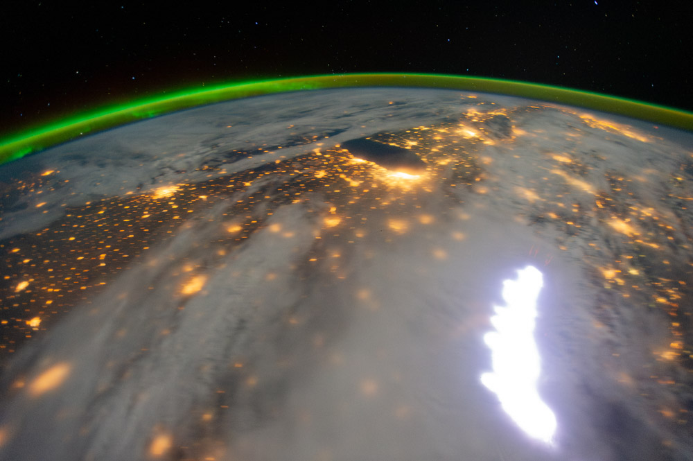](thumbnails/edit/iss029e028787.jpg "Full resolution will be uploaded to Flickr") | TLE Type: sprite    Astronaut: *Unknown* | [Full resolution](https://eol.jsc.nasa.gov/DatabaseImages/ESC/large/ISS029/ISS029-E-28787.JPG)    [Request Raw](https://eol.jsc.nasa.gov/SearchPhotos/RequestOriginalImage.pl?mission=ISS029&roll=E&frame=028787&file=iss029e028787.NEF) |
| [ISS029-E-34192](https://eol.jsc.nasa.gov/SearchPhotos/photo.pl?mission=ISS029&roll=E&frame=34192 "Link to the image listing") | [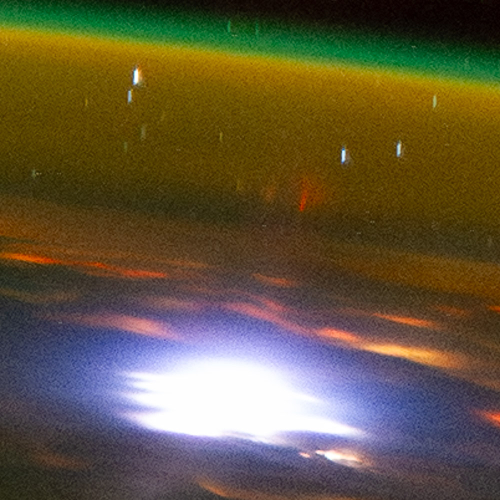](thumbnails/crop/iss029e034192.jpg "Full resolution will be uploaded to Flickr") |  | TLE Type: sprite    Astronaut: *Unknown* | [Full resolution](https://eol.jsc.nasa.gov/DatabaseImages/ESC/large/ISS029/ISS029-E-34192.JPG)    [Request Raw](https://eol.jsc.nasa.gov/SearchPhotos/RequestOriginalImage.pl?mission=ISS029&roll=E&frame=034192&file=iss029e034192.NEF) |
| [ISS029-E-37312](https://eol.jsc.nasa.gov/SearchPhotos/photo.pl?mission=ISS029&roll=E&frame=37312 "Link to the image listing") | [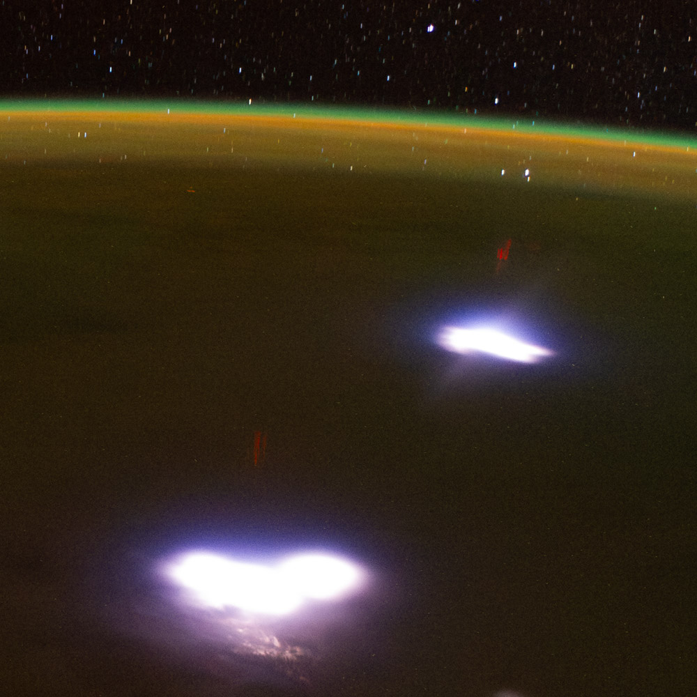](thumbnails/crop/iss029e037312.jpg "Full resolution will be uploaded to Flickr") | [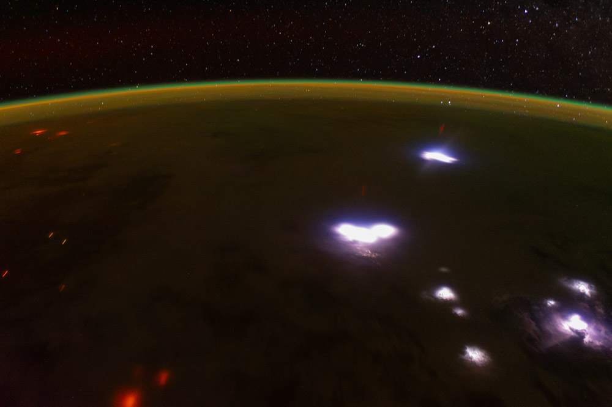](thumbnails/edit/iss029e037312.jpg "Full resolution will be uploaded to Flickr") | TLE Type: sprite    Astronaut: *Unknown* | [Full resolution](https://eol.jsc.nasa.gov/DatabaseImages/ESC/large/ISS029/ISS029-E-37312.JPG)    [Request Raw](https://eol.jsc.nasa.gov/SearchPhotos/RequestOriginalImage.pl?mission=ISS029&roll=E&frame=037312&file=iss029e037312.NEF) |
| [ISS029-E-37318](https://eol.jsc.nasa.gov/SearchPhotos/photo.pl?mission=ISS029&roll=E&frame=37318 "Link to the image listing") |  | [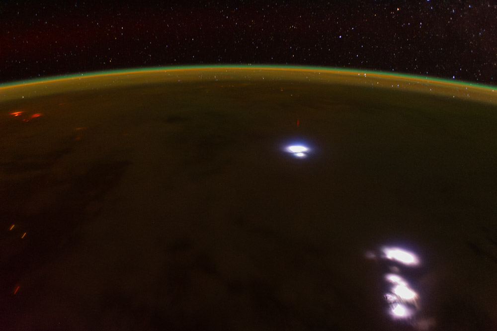](thumbnails/edit/iss029e037318.jpg "Full resolution will be uploaded to Flickr") | TLE Type: sprite    Astronaut: *Unknown* | [Full resolution](https://eol.jsc.nasa.gov/DatabaseImages/ESC/large/ISS029/ISS029-E-37318.JPG)    [Request Raw](https://eol.jsc.nasa.gov/SearchPhotos/RequestOriginalImage.pl?mission=ISS029&roll=E&frame=037318&file=iss029e037318.NEF) |
| [ISS030-E-227588](https://eol.jsc.nasa.gov/SearchPhotos/photo.pl?mission=ISS030&roll=E&frame=227588 "Link to the image listing") | [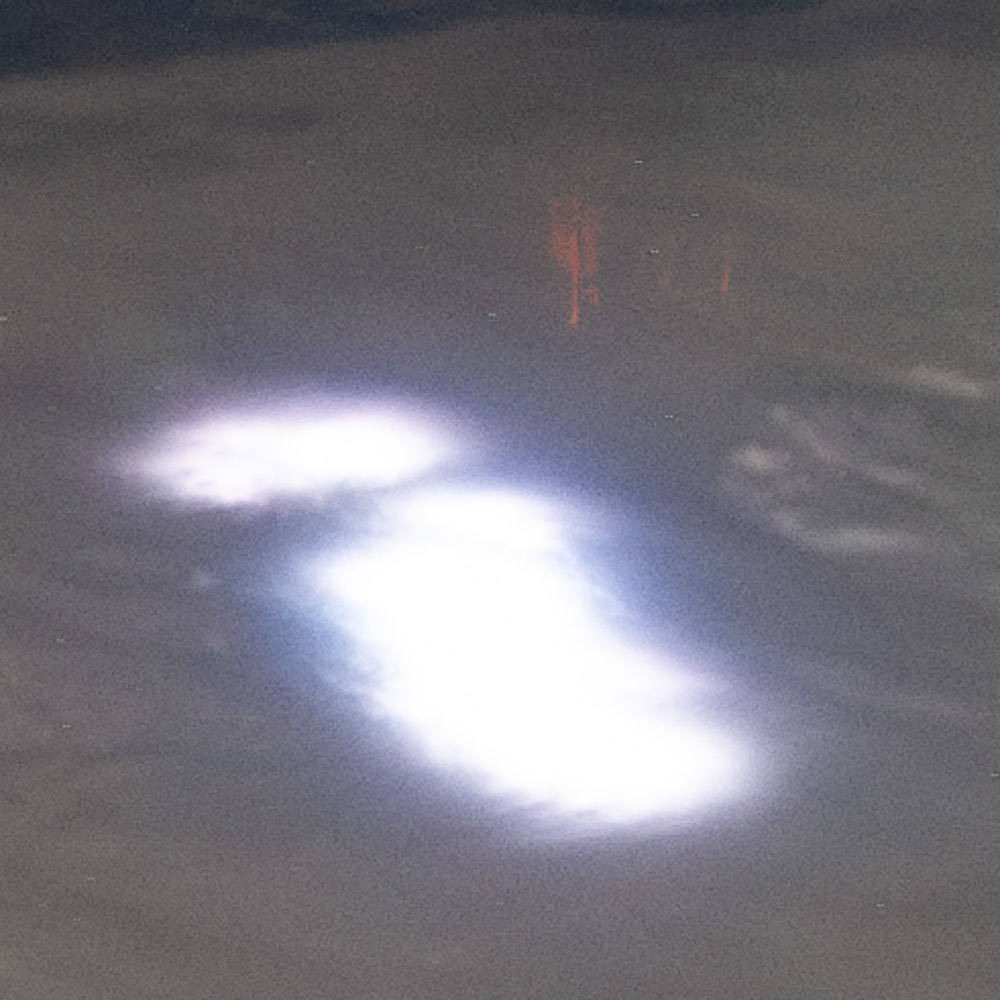](thumbnails/crop/iss030e227588.jpg "Full resolution will be uploaded to Flickr") | [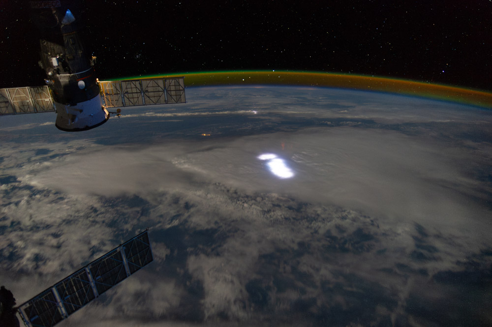](thumbnails/edit/iss030e227588.jpg "Full resolution will be uploaded to Flickr") | TLE Type: sprite    Astronaut: *Unknown* | [Full resolution](https://eol.jsc.nasa.gov/DatabaseImages/ESC/large/ISS030/ISS030-E-227588.JPG)    [Request Raw](https://eol.jsc.nasa.gov/SearchPhotos/RequestOriginalImage.pl?mission=ISS030&roll=E&frame=227588&file=iss030e227588.NEF) |
| [ISS030-E-68922](https://eol.jsc.nasa.gov/SearchPhotos/photo.pl?mission=ISS030&roll=E&frame=68922 "Link to the image listing") | [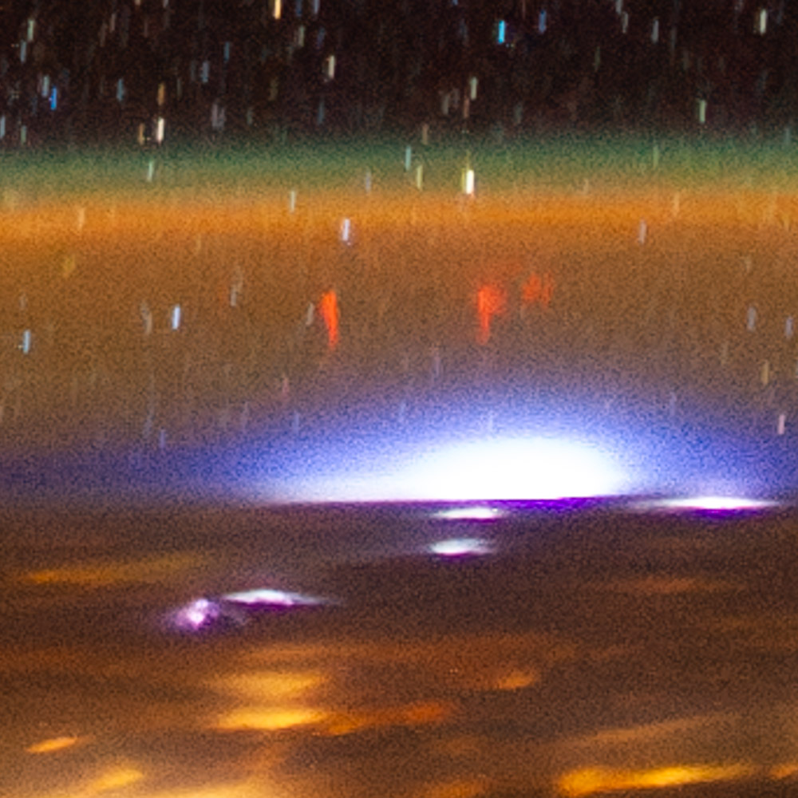](thumbnails/crop/iss030e068922.jpg "Full resolution will be uploaded to Flickr") | [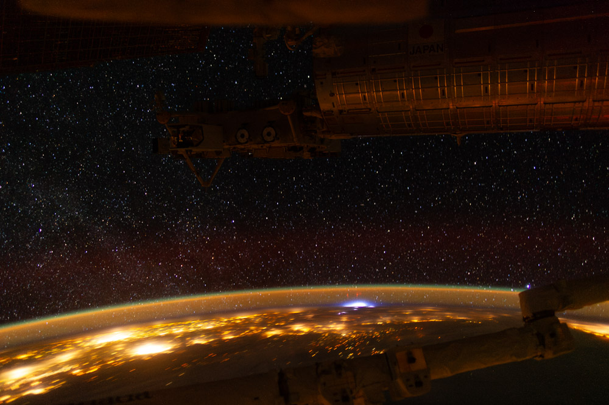](thumbnails/edit/iss030e068922.jpg "Full resolution will be uploaded to Flickr") | TLE Type: sprite    Astronaut: Don Pettit | [Full resolution](https://eol.jsc.nasa.gov/DatabaseImages/ESC/large/ISS030/ISS030-E-68922.JPG)    [Request Raw](https://eol.jsc.nasa.gov/SearchPhotos/RequestOriginalImage.pl?mission=ISS030&roll=E&frame=068922&file=iss030e068922.NEF) |
| [ISS030-E-68942](https://eol.jsc.nasa.gov/SearchPhotos/photo.pl?mission=ISS030&roll=E&frame=68942 "Link to the image listing") | [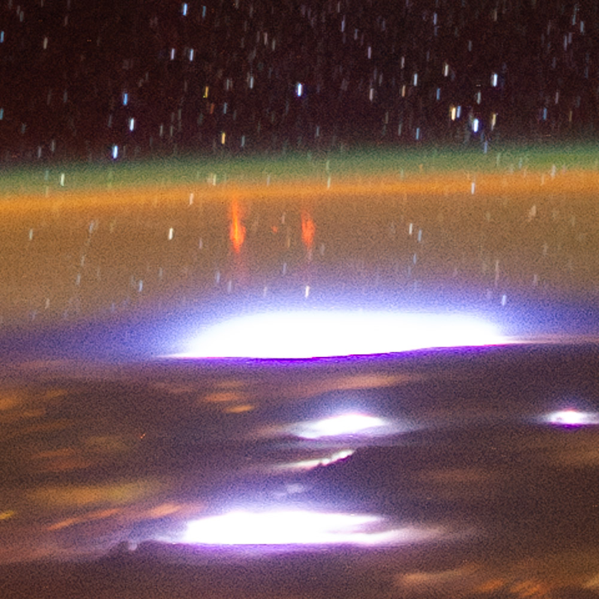](thumbnails/crop/iss030e068942.jpg "Full resolution will be uploaded to Flickr") | [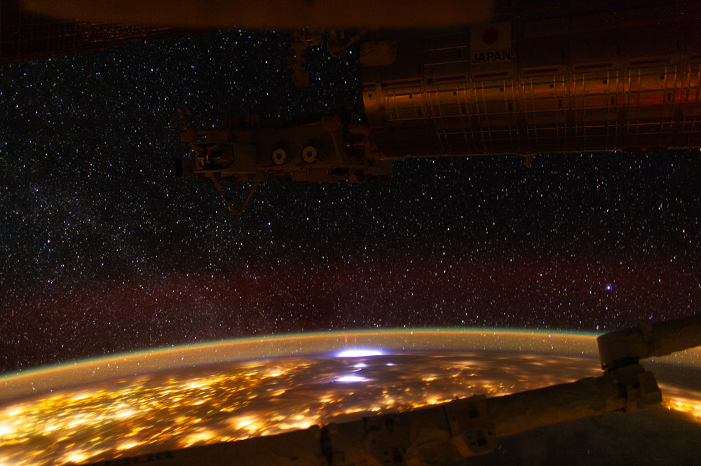](thumbnails/edit/iss030e068942.jpg "Full resolution will be uploaded to Flickr") | TLE Type: sprite    Astronaut: Don Pettit | [Full resolution](https://eol.jsc.nasa.gov/DatabaseImages/ESC/large/ISS030/ISS030-E-68942.JPG)    [Request Raw](https://eol.jsc.nasa.gov/SearchPhotos/RequestOriginalImage.pl?mission=ISS030&roll=E&frame=068942&file=iss030e068942.NEF) |
| [ISS031-E-10712](https://eol.jsc.nasa.gov/SearchPhotos/photo.pl?mission=ISS031&roll=E&frame=10712 "Link to the image listing") | [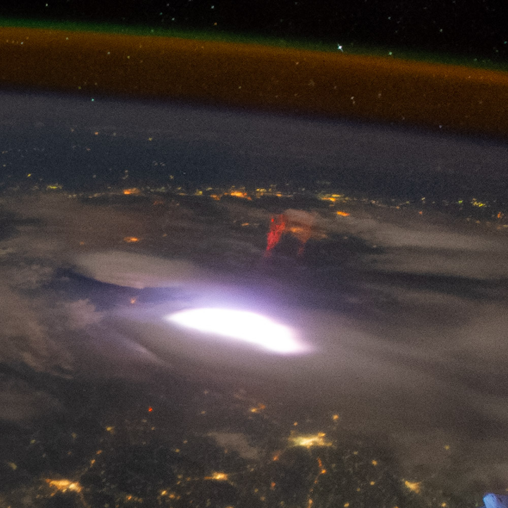](thumbnails/crop/iss031e010712.jpg "Full resolution will be uploaded to Flickr") | [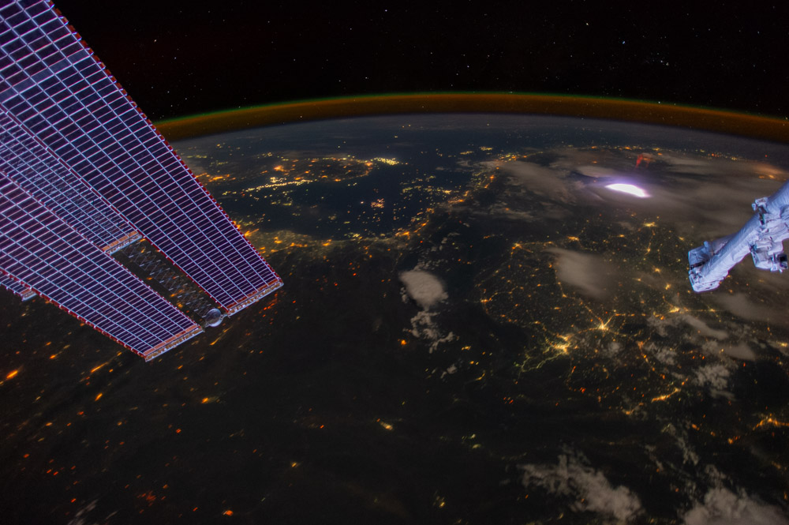](thumbnails/edit/iss031e010712.jpg "Full resolution will be uploaded to Flickr") | TLE Type: sprite    Astronaut: *Unknown* | [Full resolution](https://eol.jsc.nasa.gov/DatabaseImages/ESC/large/ISS031/ISS031-E-10712.JPG)    [Request Raw](https://eol.jsc.nasa.gov/SearchPhotos/RequestOriginalImage.pl?mission=ISS031&roll=E&frame=010712&file=iss031e010712.NEF) |
| [ISS031-E-151873](https://eol.jsc.nasa.gov/SearchPhotos/photo.pl?mission=ISS031&roll=E&frame=151873 "Link to the image listing") | [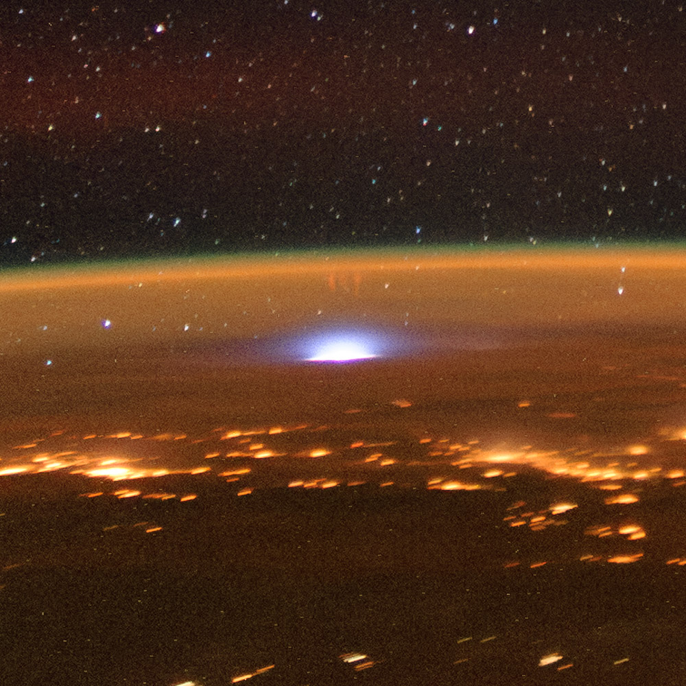](thumbnails/crop/iss031e151873.jpg "Full resolution will be uploaded to Flickr") | [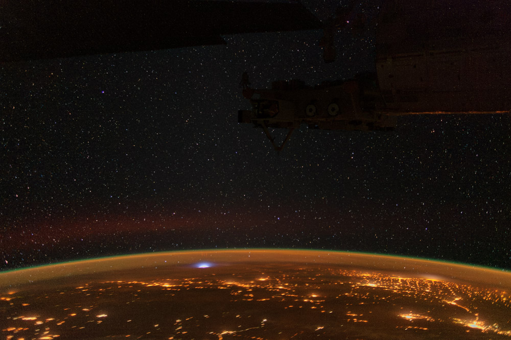](thumbnails/edit/iss031e151873.jpg "Full resolution will be uploaded to Flickr") | TLE Type: sprite    Astronaut: *Unknown* | [Full resolution](https://eol.jsc.nasa.gov/DatabaseImages/ESC/large/ISS031/ISS031-E-151873.JPG)    [Request Raw](https://eol.jsc.nasa.gov/SearchPhotos/RequestOriginalImage.pl?mission=ISS031&roll=E&frame=151873&file=iss031e151873.NEF) |
| [ISS041-E-18091](https://eol.jsc.nasa.gov/SearchPhotos/photo.pl?mission=ISS041&roll=E&frame=18091 "Link to the image listing") | [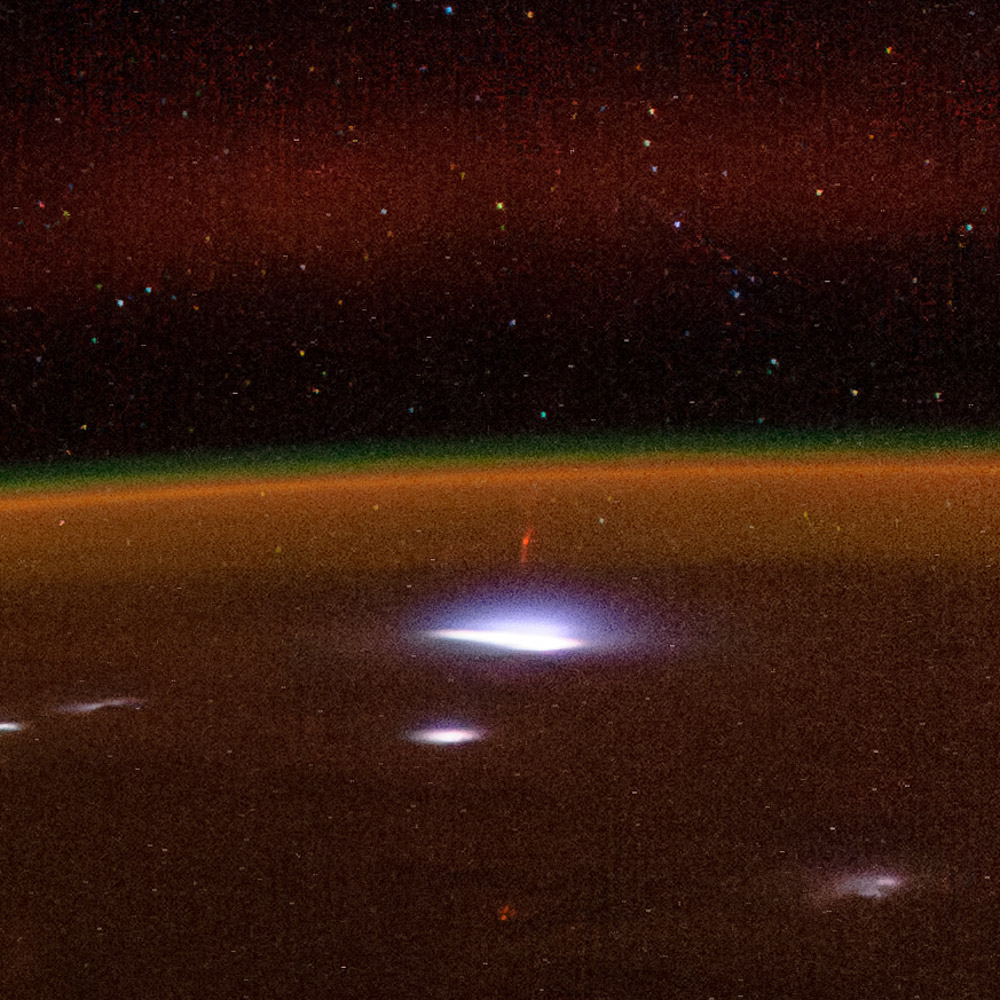](thumbnails/crop/iss041e018091.jpg "Full resolution will be uploaded to Flickr") | [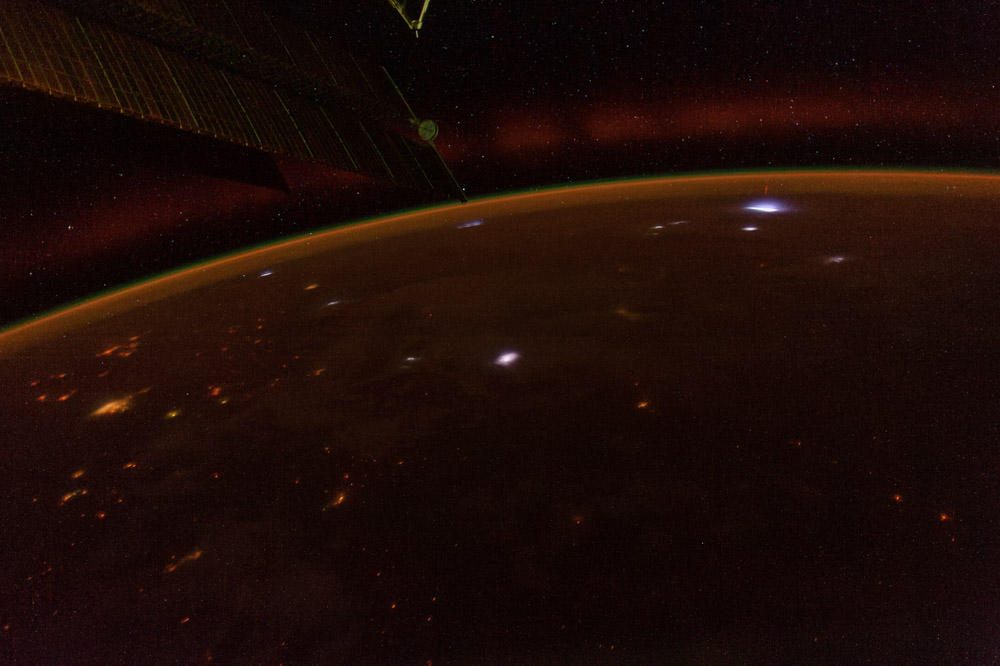](thumbnails/edit/iss041e018091.jpg "Full resolution will be uploaded to Flickr") | TLE Type: sprite    Astronaut: *Unknown* | [Full resolution](https://eol.jsc.nasa.gov/DatabaseImages/ESC/large/ISS041/ISS041-E-18091.JPG)    [Request Raw](https://eol.jsc.nasa.gov/SearchPhotos/RequestOriginalImage.pl?mission=ISS041&roll=E&frame=018091&file=iss041e018091.NEF) |
| [ISS041-E-18127](https://eol.jsc.nasa.gov/SearchPhotos/photo.pl?mission=ISS041&roll=E&frame=18127 "Link to the image listing") | [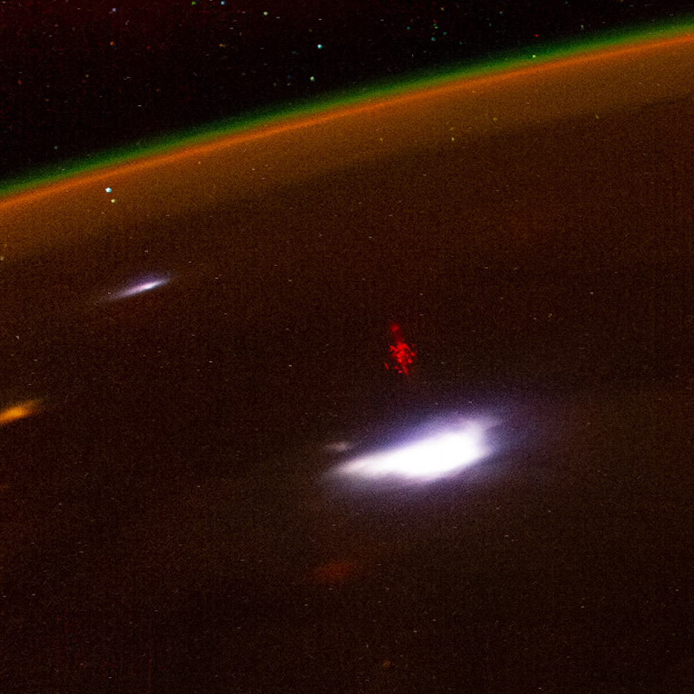](thumbnails/crop/iss041e018127.jpg "Full resolution will be uploaded to Flickr") | [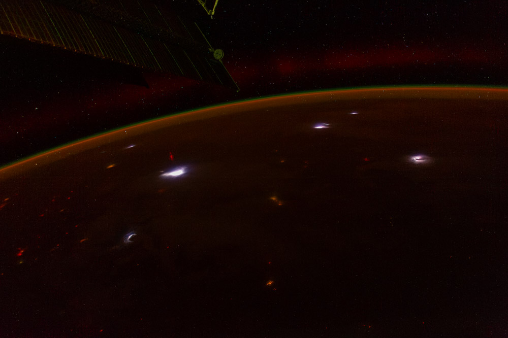](thumbnails/edit/iss041e018127.jpg "Full resolution will be uploaded to Flickr") | TLE Type: sprite    Astronaut: *Unknown* | [Full resolution](https://eol.jsc.nasa.gov/DatabaseImages/ESC/large/ISS041/ISS041-E-18127.JPG)    [Request Raw](https://eol.jsc.nasa.gov/SearchPhotos/RequestOriginalImage.pl?mission=ISS041&roll=E&frame=018127&file=iss041e018127.NEF) |
| [ISS042-E-295603](https://eol.jsc.nasa.gov/SearchPhotos/photo.pl?mission=ISS042&roll=E&frame=295603 "Link to the image listing") | [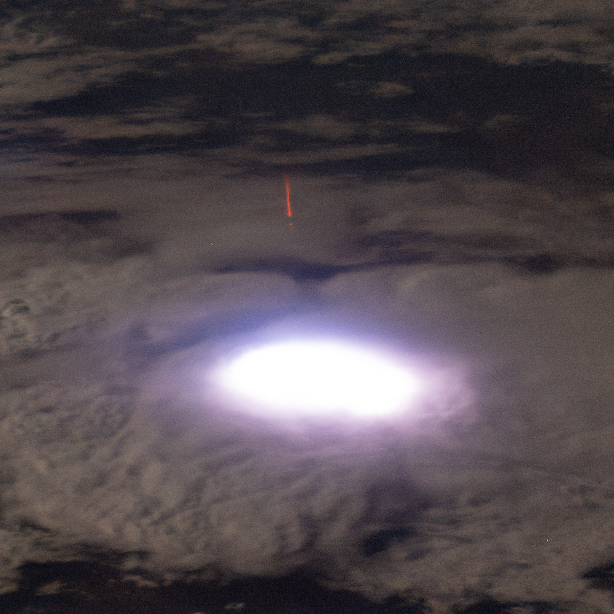](thumbnails/crop/iss042e295603.jpg "Full resolution will be uploaded to Flickr") | [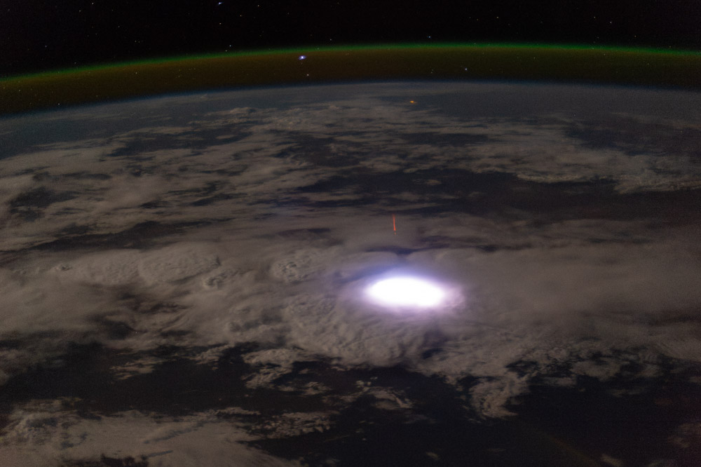](thumbnails/edit/iss042e295603.jpg "Full resolution will be uploaded to Flickr") | TLE Type: sprite    Astronaut: *Unknown* | [Full resolution](https://eol.jsc.nasa.gov/DatabaseImages/ESC/large/ISS042/ISS042-E-295603.JPG)    [Request Raw](https://eol.jsc.nasa.gov/SearchPhotos/RequestOriginalImage.pl?mission=ISS042&roll=E&frame=295603&file=iss042e295603.NEF) |
| [ISS043-E-197862](https://eol.jsc.nasa.gov/SearchPhotos/photo.pl?mission=ISS043&roll=E&frame=197862 "Link to the image listing") | [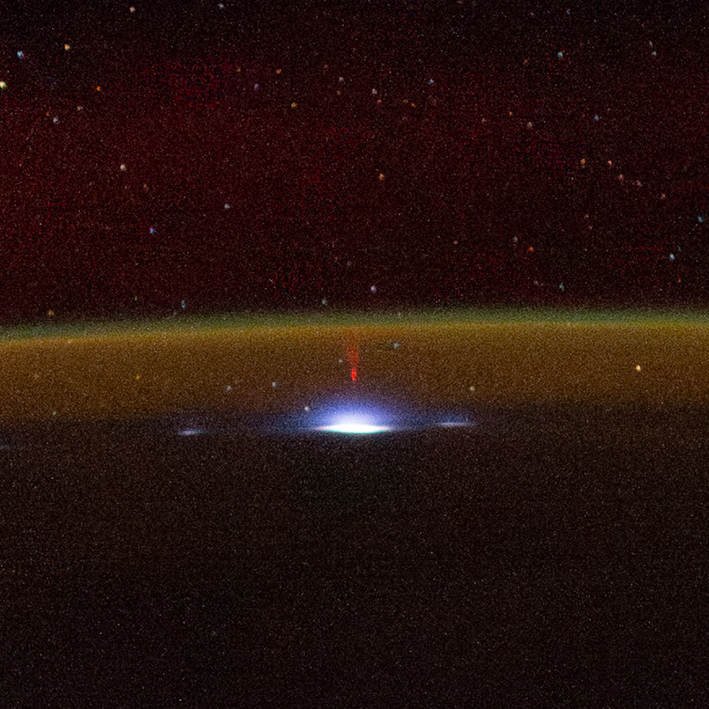](thumbnails/crop/iss043e197862.jpg "Full resolution will be uploaded to Flickr") | [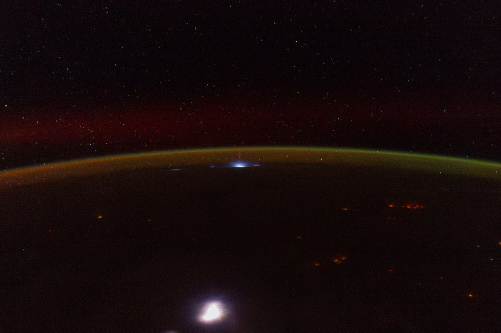](thumbnails/edit/iss043e197862.jpg "Full resolution will be uploaded to Flickr") | TLE Type: sprite    Astronaut: *Unknown* | [Full resolution](https://eol.jsc.nasa.gov/DatabaseImages/ESC/large/ISS043/ISS043-E-197862.JPG)    [Request Raw](https://eol.jsc.nasa.gov/SearchPhotos/RequestOriginalImage.pl?mission=ISS043&roll=E&frame=197862&file=iss043e197862.NEF) |
| [ISS043-E-197864](https://eol.jsc.nasa.gov/SearchPhotos/photo.pl?mission=ISS043&roll=E&frame=197864 "Link to the image listing") | [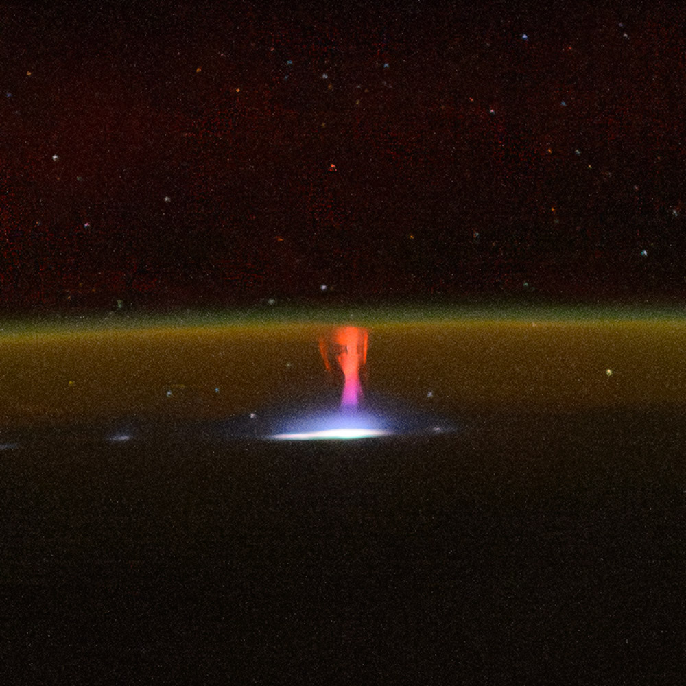](thumbnails/crop/iss043e197864.jpg "Full resolution will be uploaded to Flickr") | [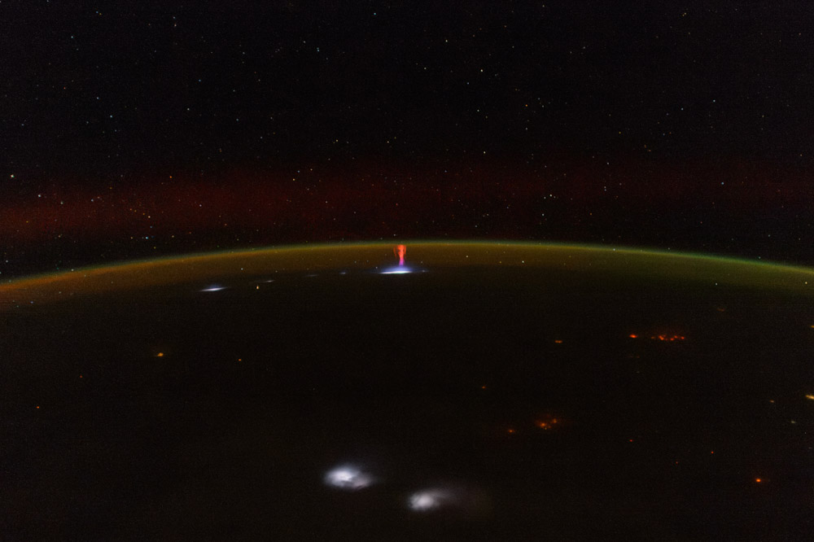](thumbnails/edit/iss043e197864.jpg "Full resolution will be uploaded to Flickr") | TLE Type: sprite    Astronaut: *Unknown* | [Full resolution](https://eol.jsc.nasa.gov/DatabaseImages/ESC/large/ISS043/ISS043-E-197864.JPG)    [Request Raw](https://eol.jsc.nasa.gov/SearchPhotos/RequestOriginalImage.pl?mission=ISS043&roll=E&frame=197864&file=iss043e197864.NEF) |
| [ISS043-E-239247](https://eol.jsc.nasa.gov/SearchPhotos/photo.pl?mission=ISS043&roll=E&frame=239247 "Link to the image listing") | [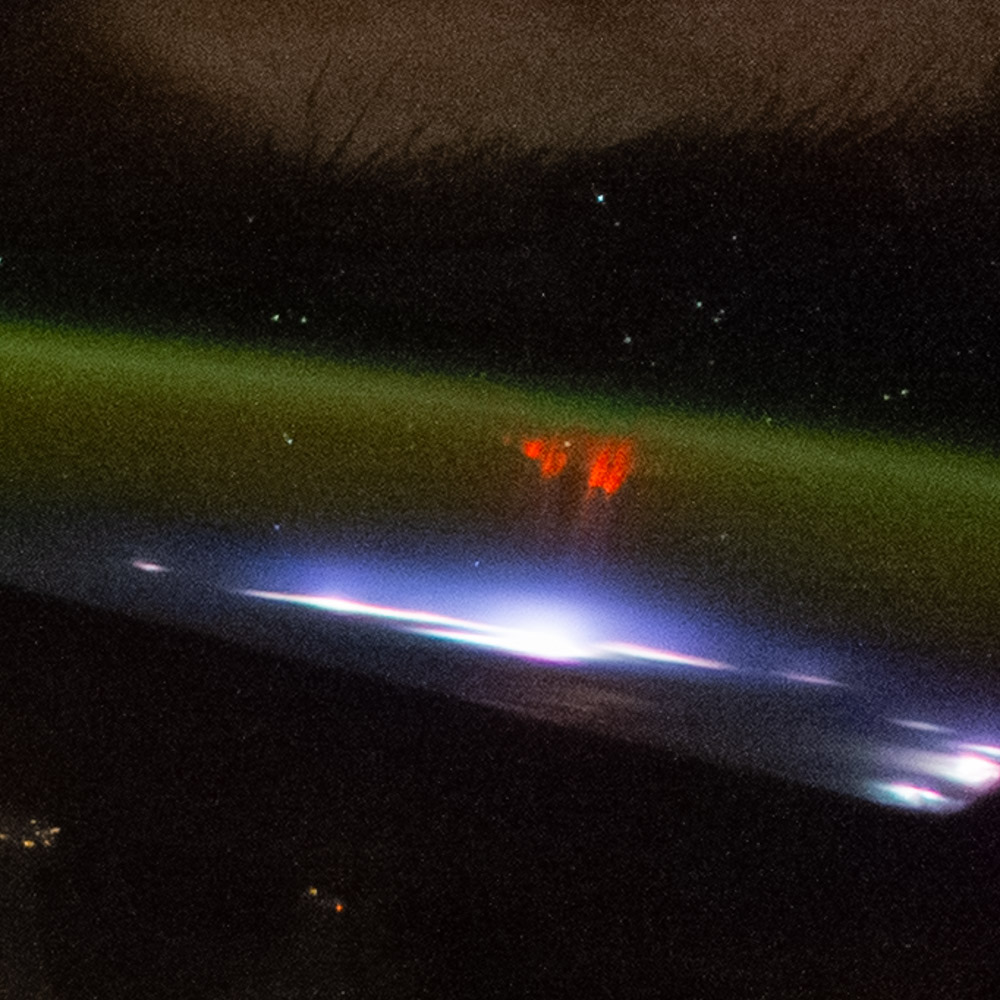](thumbnails/crop/iss043e239247.jpg "Full resolution will be uploaded to Flickr") | [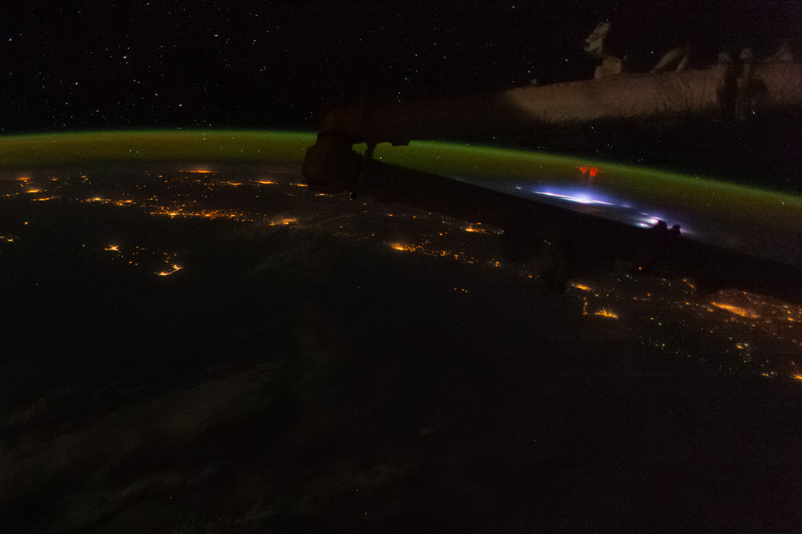](thumbnails/edit/iss043e239247.jpg "Full resolution will be uploaded to Flickr") | TLE Type: sprite    Astronaut: *Unknown* | [Full resolution](https://eol.jsc.nasa.gov/DatabaseImages/ESC/large/ISS043/ISS043-E-239247.JPG)    [Request Raw](https://eol.jsc.nasa.gov/SearchPhotos/RequestOriginalImage.pl?mission=ISS043&roll=E&frame=239247&file=iss043e239247.NEF) |
| [ISS043-E-298868](https://eol.jsc.nasa.gov/SearchPhotos/photo.pl?mission=ISS043&roll=E&frame=298868 "Link to the image listing") | [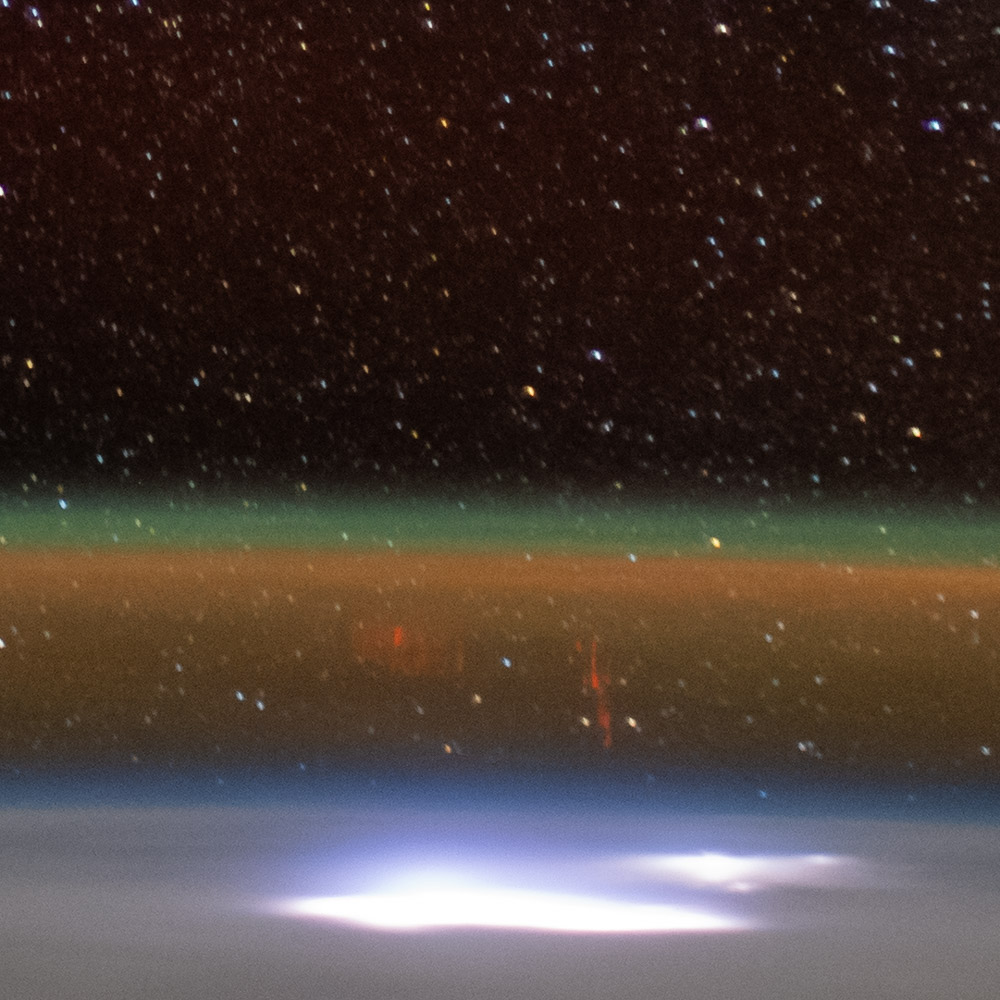](thumbnails/crop/iss043e298868.jpg "Full resolution will be uploaded to Flickr") | [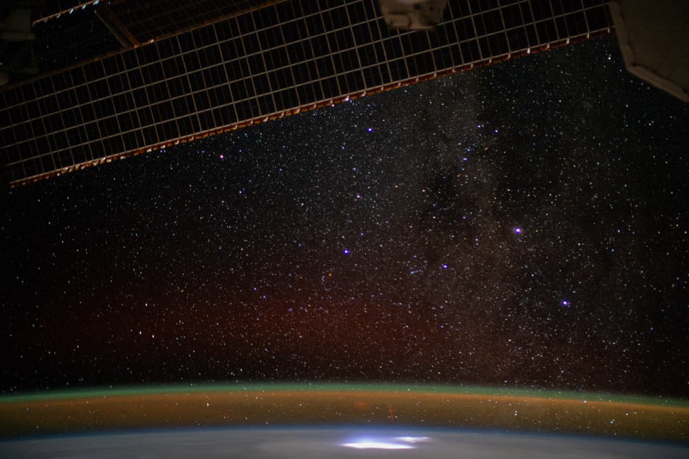](thumbnails/edit/iss043e298868.jpg "Full resolution will be uploaded to Flickr") | TLE Type: sprite    Astronaut: *Unknown* | [Full resolution](https://eol.jsc.nasa.gov/DatabaseImages/ESC/large/ISS043/ISS043-E-298868.JPG)    [Request Raw](https://eol.jsc.nasa.gov/SearchPhotos/RequestOriginalImage.pl?mission=ISS043&roll=E&frame=298868&file=iss043e298868.NEF) |
| [ISS043-E-304383](https://eol.jsc.nasa.gov/SearchPhotos/photo.pl?mission=ISS043&roll=E&frame=304383 "Link to the image listing") | [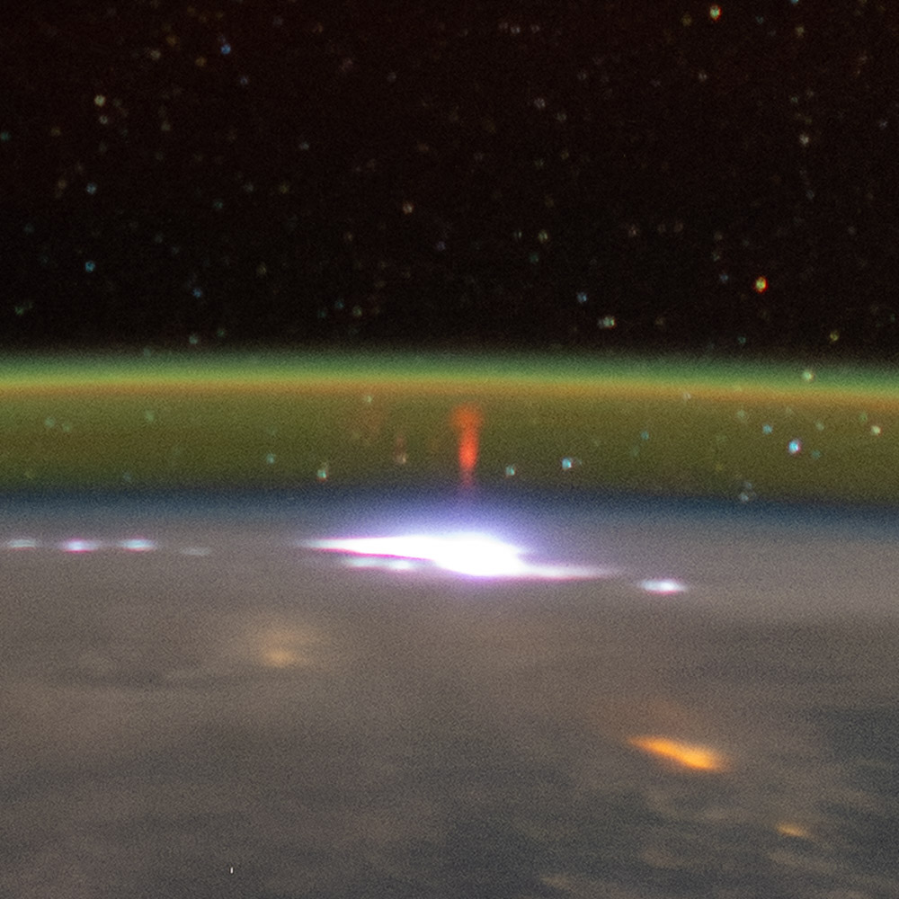](thumbnails/crop/iss043e304383.jpg "Full resolution will be uploaded to Flickr") | [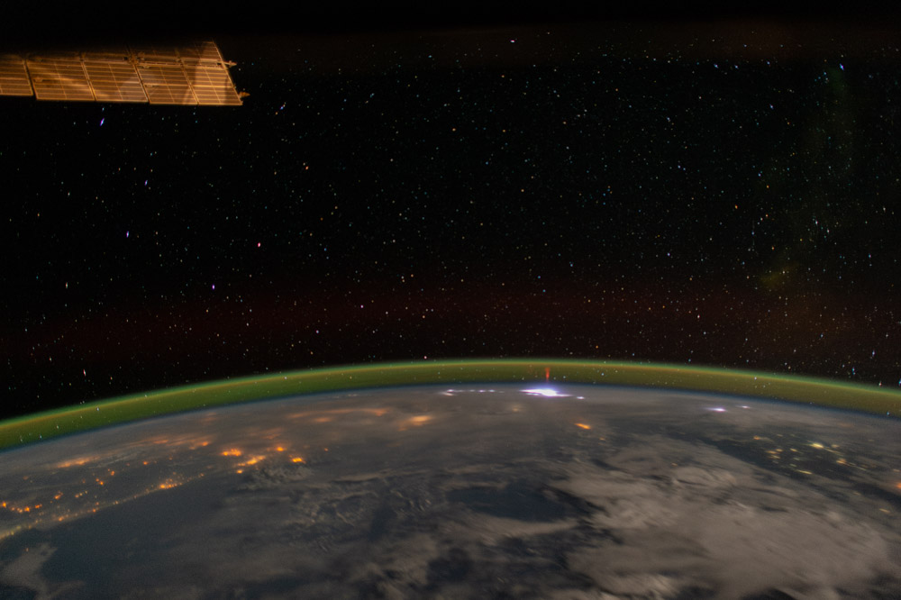](thumbnails/edit/iss043e304383.jpg "Full resolution will be uploaded to Flickr") | TLE Type: sprite    Astronaut: *Unknown* | [Full resolution](https://eol.jsc.nasa.gov/DatabaseImages/ESC/large/ISS043/ISS043-E-304383.JPG)    [Request Raw](https://eol.jsc.nasa.gov/SearchPhotos/RequestOriginalImage.pl?mission=ISS043&roll=E&frame=304383&file=iss043e304383.NEF) |
| [ISS044-E-45553](https://eol.jsc.nasa.gov/SearchPhotos/photo.pl?mission=ISS044&roll=E&frame=45553 "Link to the image listing") | [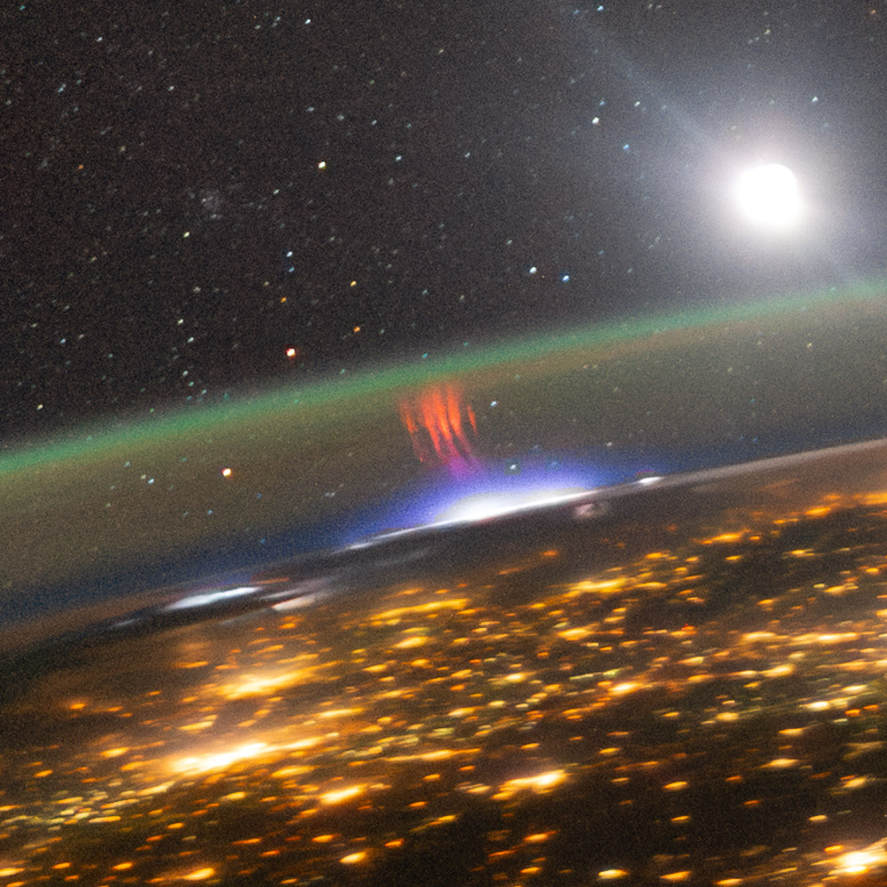](thumbnails/crop/iss044e045553.jpg "Full resolution will be uploaded to Flickr") | [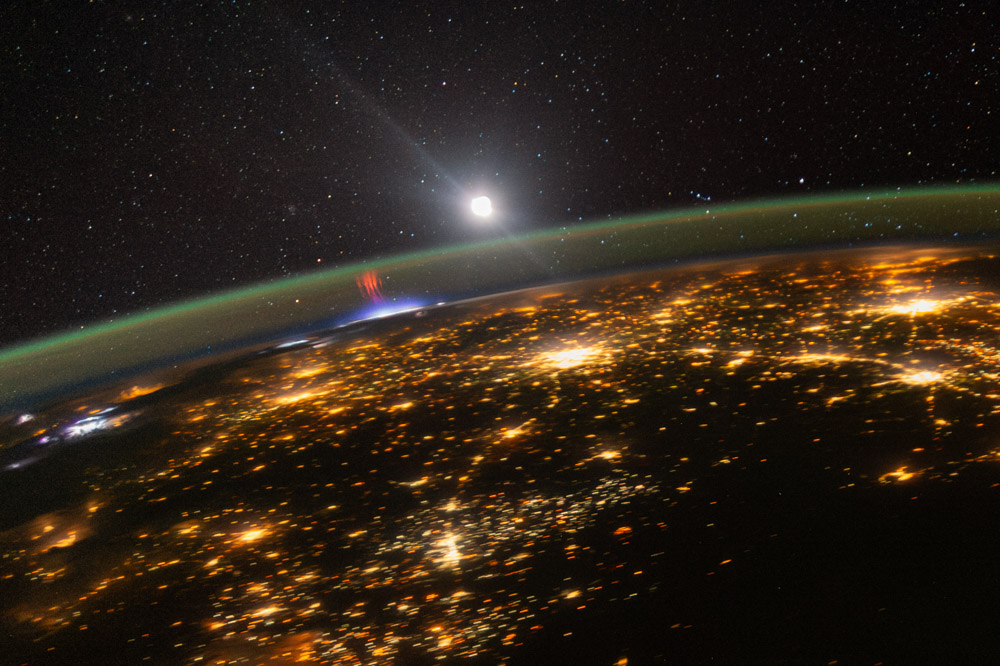](thumbnails/edit/iss044e045553.jpg "Full resolution will be uploaded to Flickr") | TLE Type: sprite    Astronaut: *Unknown* | [Full resolution](https://eol.jsc.nasa.gov/DatabaseImages/ESC/large/ISS044/ISS044-E-45553.JPG)    [Request Raw](https://eol.jsc.nasa.gov/SearchPhotos/RequestOriginalImage.pl?mission=ISS044&roll=E&frame=045553&file=iss044e045553.NEF) |
| [ISS044-E-45576](https://eol.jsc.nasa.gov/SearchPhotos/photo.pl?mission=ISS044&roll=E&frame=45576 "Link to the image listing") | [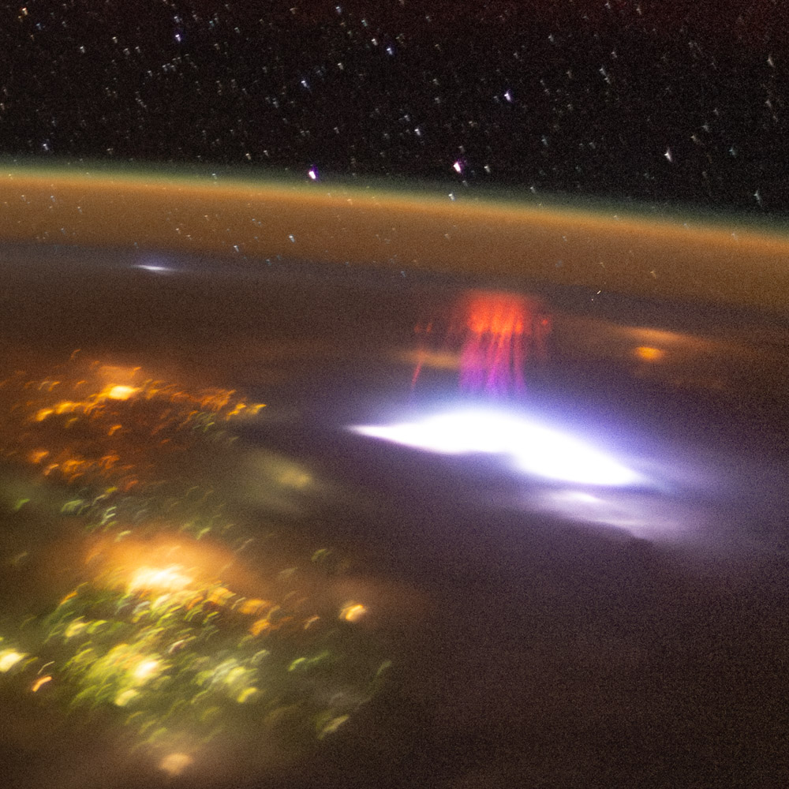](thumbnails/crop/iss044e045576.jpg "Full resolution will be uploaded to Flickr") | [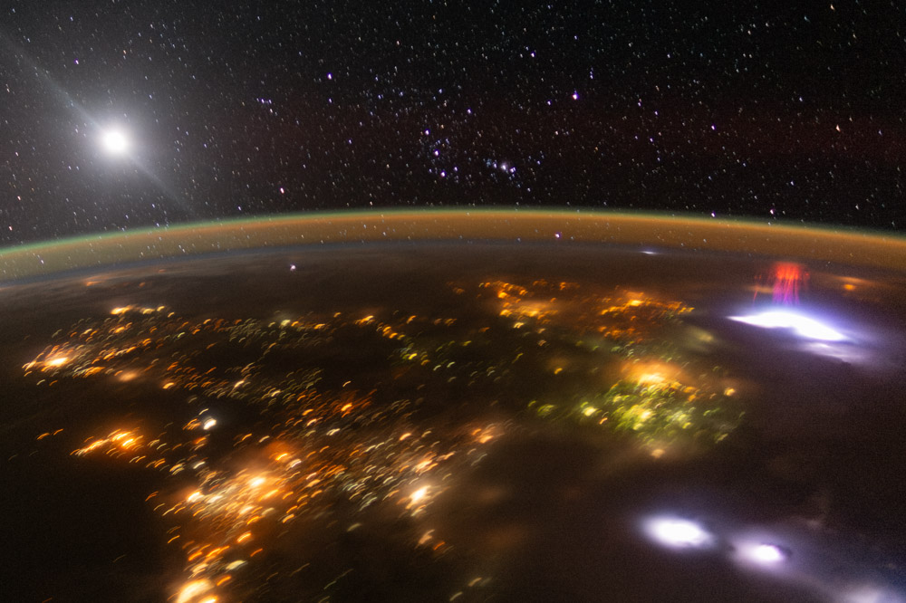](thumbnails/edit/iss044e045576.jpg "Full resolution will be uploaded to Flickr") | TLE Type: sprite    Astronaut: *Unknown* | [Full resolution](https://eol.jsc.nasa.gov/DatabaseImages/ESC/large/ISS044/ISS044-E-45576.JPG)    [Request Raw](https://eol.jsc.nasa.gov/SearchPhotos/RequestOriginalImage.pl?mission=ISS044&roll=E&frame=045576&file=iss044e045576.NEF) |
| [ISS044-E-47890](https://eol.jsc.nasa.gov/SearchPhotos/photo.pl?mission=ISS044&roll=E&frame=47890 "Link to the image listing") | [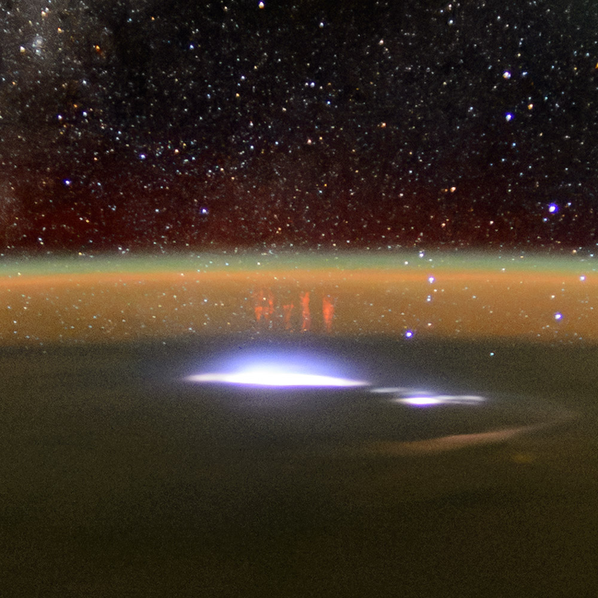](thumbnails/crop/iss044e047890.jpg "Full resolution will be uploaded to Flickr") | [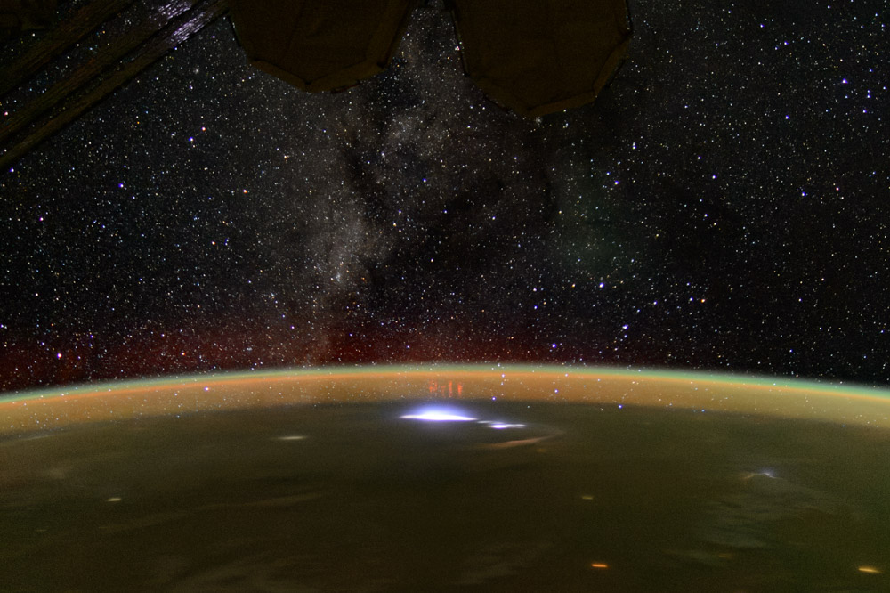](thumbnails/edit/iss044e047890.jpg "Full resolution will be uploaded to Flickr") | TLE Type: sprite    Astronaut: *Unknown* | [Full resolution](https://eol.jsc.nasa.gov/DatabaseImages/ESC/large/ISS044/ISS044-E-47890.JPG)    [Request Raw](https://eol.jsc.nasa.gov/SearchPhotos/RequestOriginalImage.pl?mission=ISS044&roll=E&frame=047890&file=iss044e047890.NEF) |
| [ISS045-E-24950](https://eol.jsc.nasa.gov/SearchPhotos/photo.pl?mission=ISS045&roll=E&frame=24950 "Link to the image listing") | [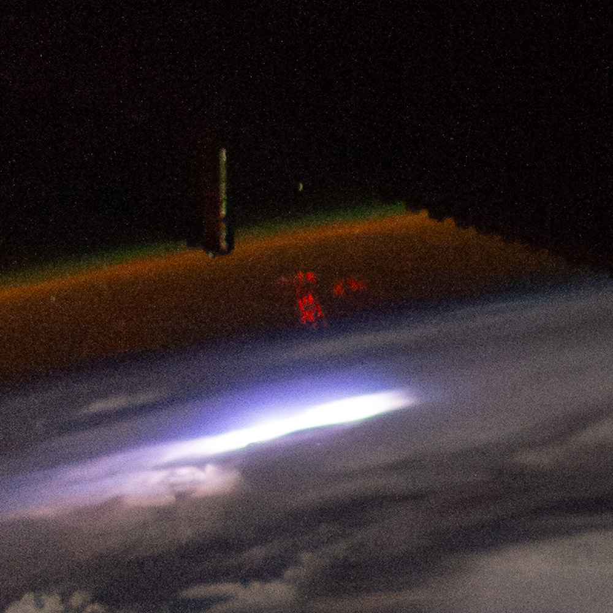](thumbnails/crop/iss045e024950.jpg "Full resolution will be uploaded to Flickr") | [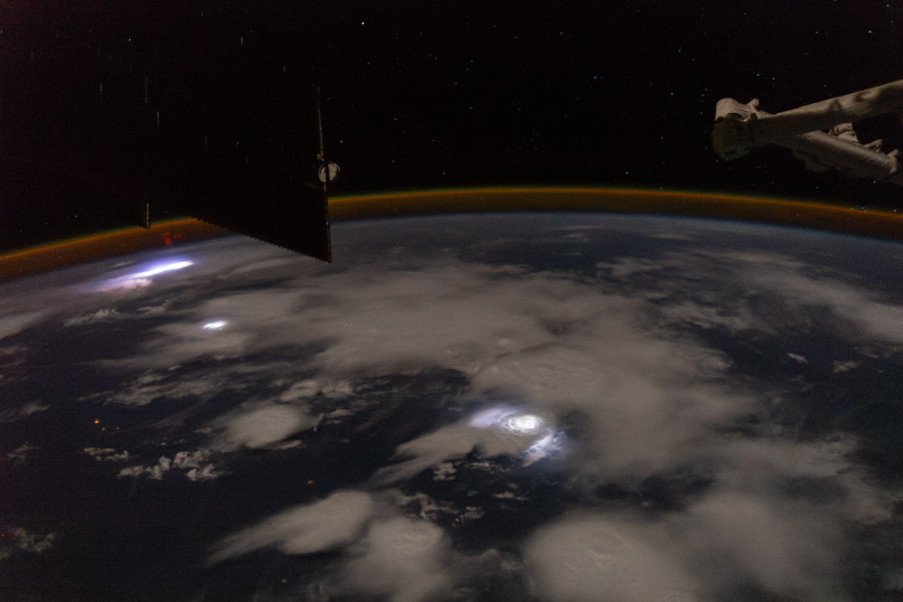](thumbnails/edit/iss045e024950.jpg "Full resolution will be uploaded to Flickr") | TLE Type: sprite    Astronaut: *Unknown* | [Full resolution](https://eol.jsc.nasa.gov/DatabaseImages/ESC/large/ISS045/ISS045-E-24950.JPG)    [Request Raw](https://eol.jsc.nasa.gov/SearchPhotos/RequestOriginalImage.pl?mission=ISS045&roll=E&frame=024950&file=iss045e024950.NEF) |
| [ISS045-E-25021](https://eol.jsc.nasa.gov/SearchPhotos/photo.pl?mission=ISS045&roll=E&frame=25021 "Link to the image listing") | [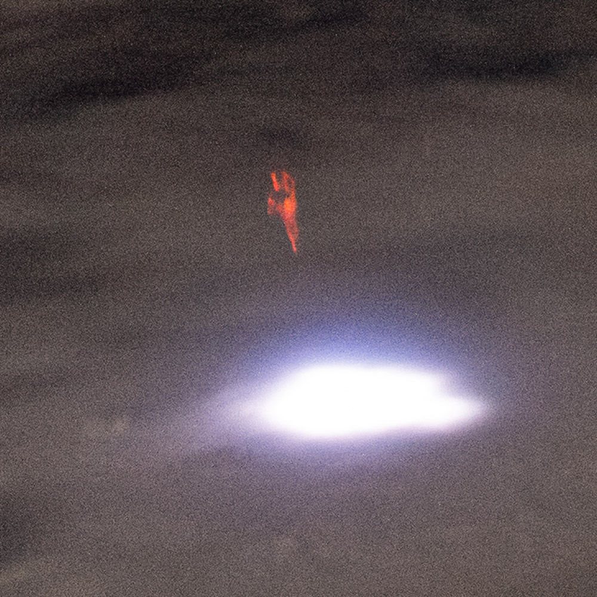](thumbnails/crop/iss045e025021.jpg "Full resolution will be uploaded to Flickr") | [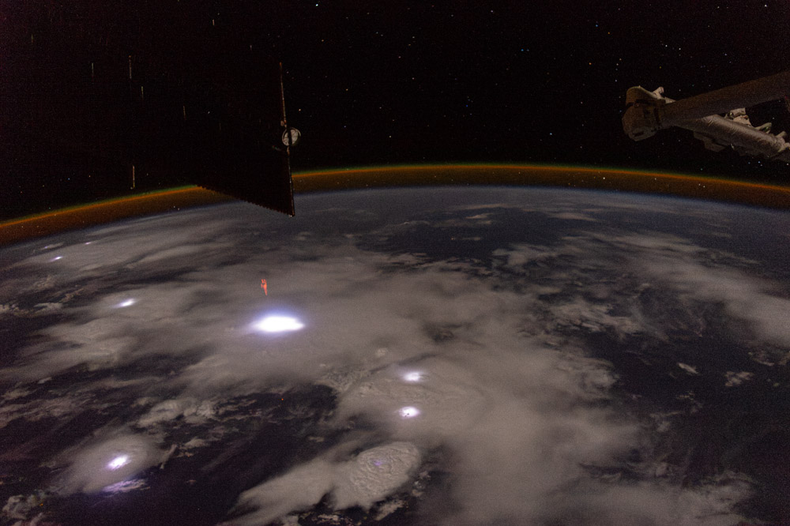](thumbnails/edit/iss045e025021.jpg "Full resolution will be uploaded to Flickr") | TLE Type: sprite    Astronaut: *Unknown* | [Full resolution](https://eol.jsc.nasa.gov/DatabaseImages/ESC/large/ISS045/ISS045-E-25021.JPG)    [Request Raw](https://eol.jsc.nasa.gov/SearchPhotos/RequestOriginalImage.pl?mission=ISS045&roll=E&frame=025021&file=iss045e025021.NEF) |
| [ISS045-E-49052](https://eol.jsc.nasa.gov/SearchPhotos/photo.pl?mission=ISS045&roll=E&frame=49052 "Link to the image listing") | [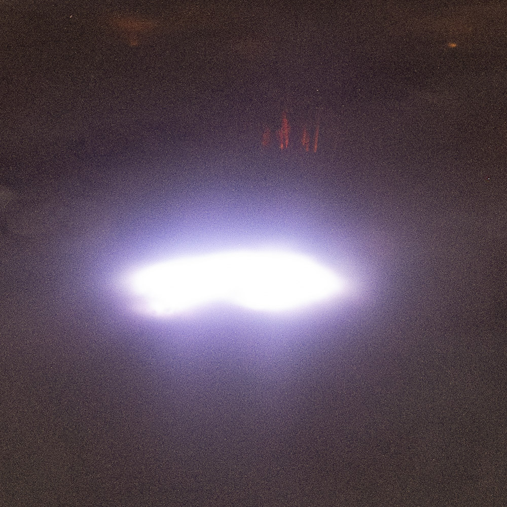](thumbnails/crop/iss045e049052.jpg "Full resolution will be uploaded to Flickr") | [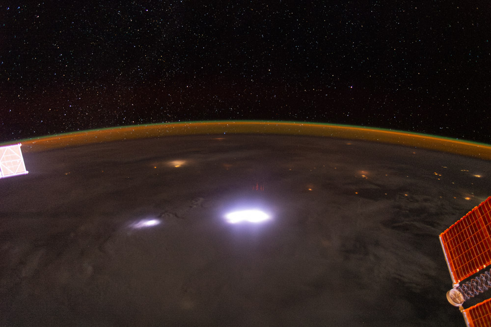](thumbnails/edit/iss045e049052.jpg "Full resolution will be uploaded to Flickr") | TLE Type: sprite    Astronaut: *Unknown* | [Full resolution](https://eol.jsc.nasa.gov/DatabaseImages/ESC/large/ISS045/ISS045-E-49052.JPG)    [Request Raw](https://eol.jsc.nasa.gov/SearchPhotos/RequestOriginalImage.pl?mission=ISS045&roll=E&frame=049052&file=iss045e049052.NEF) |
| [ISS047-E-7490](https://eol.jsc.nasa.gov/SearchPhotos/photo.pl?mission=ISS047&roll=E&frame=7490 "Link to the image listing") | [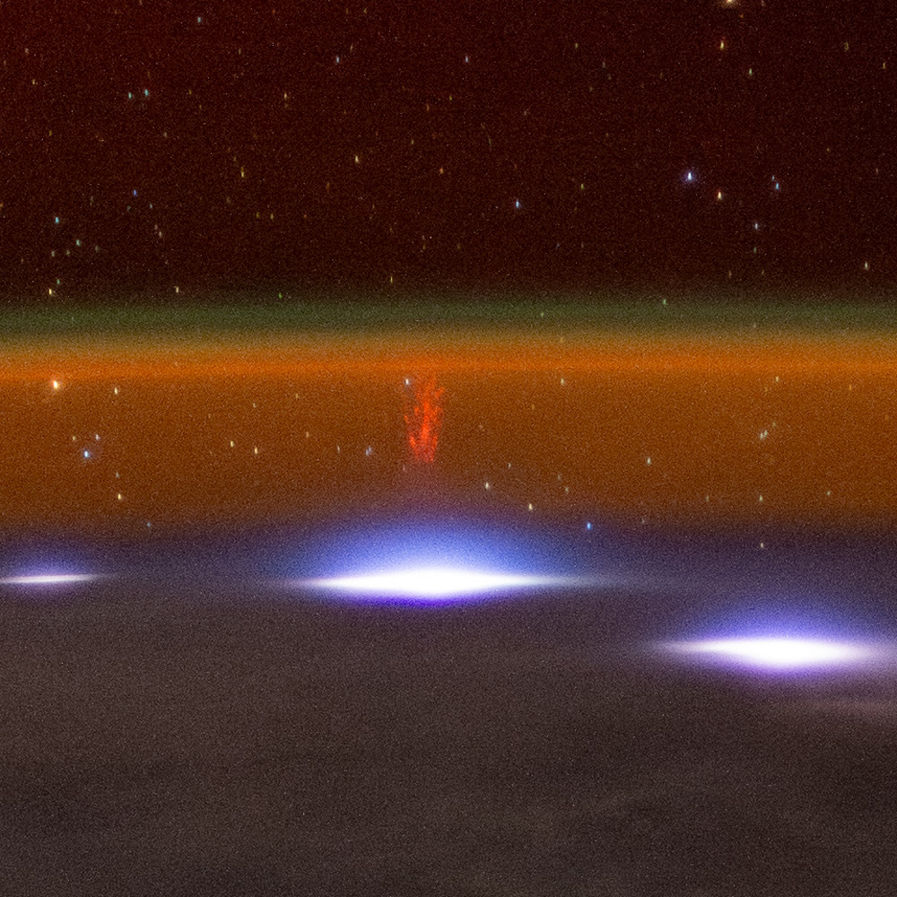](thumbnails/crop/iss047e007490.jpg "Full resolution will be uploaded to Flickr") | [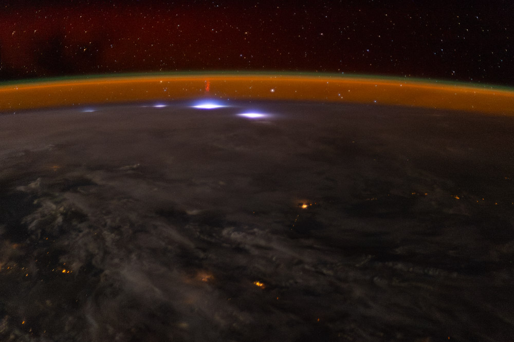](thumbnails/edit/iss047e007490.jpg "Full resolution will be uploaded to Flickr") | TLE Type: sprite    Astronaut: *Unknown* | [Full resolution](https://eol.jsc.nasa.gov/DatabaseImages/ESC/large/ISS047/ISS047-E-7490.JPG)    [Request Raw](https://eol.jsc.nasa.gov/SearchPhotos/RequestOriginalImage.pl?mission=ISS047&roll=E&frame=007490&file=iss047e007490.NEF) |
| [ISS047-E-7501](https://eol.jsc.nasa.gov/SearchPhotos/photo.pl?mission=ISS047&roll=E&frame=7501 "Link to the image listing") | [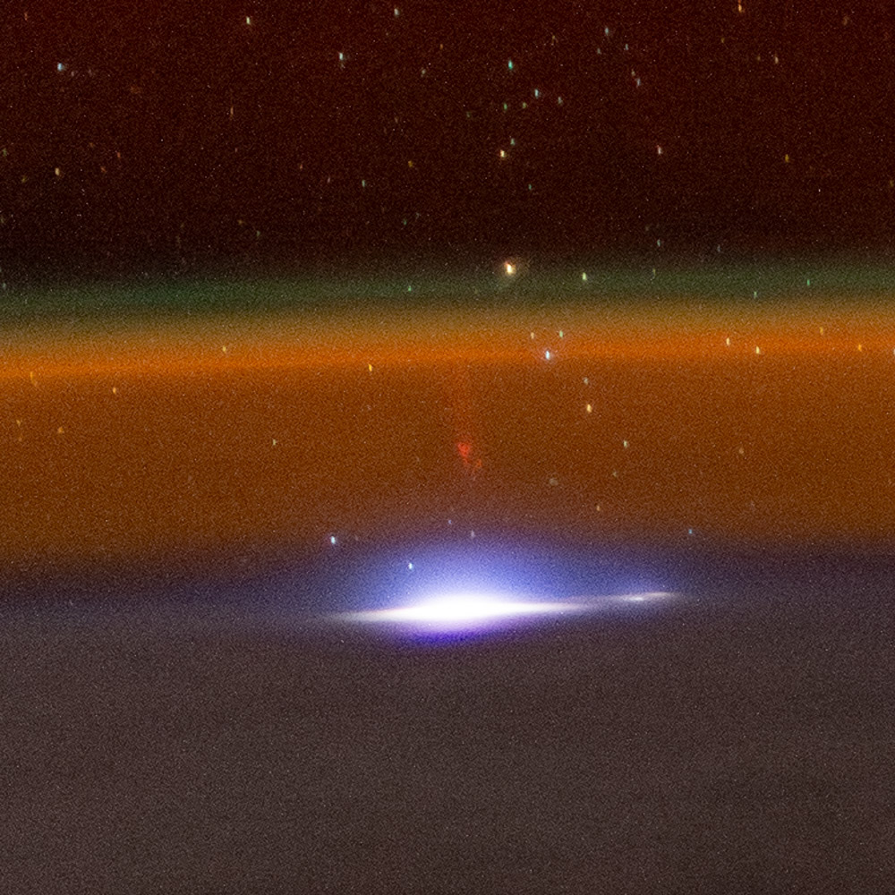](thumbnails/crop/iss047e007501.jpg "Full resolution will be uploaded to Flickr") | [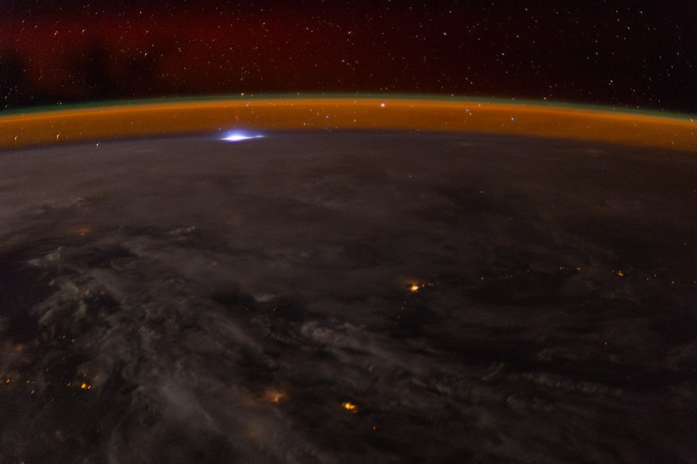](thumbnails/edit/iss047e007501.jpg "Full resolution will be uploaded to Flickr") | TLE Type: sprite    Astronaut: *Unknown* | [Full resolution](https://eol.jsc.nasa.gov/DatabaseImages/ESC/large/ISS047/ISS047-E-7501.JPG)    [Request Raw](https://eol.jsc.nasa.gov/SearchPhotos/RequestOriginalImage.pl?mission=ISS047&roll=E&frame=007501&file=iss047e007501.NEF) |
| [ISS047-E-7555](https://eol.jsc.nasa.gov/SearchPhotos/photo.pl?mission=ISS047&roll=E&frame=7555 "Link to the image listing") | [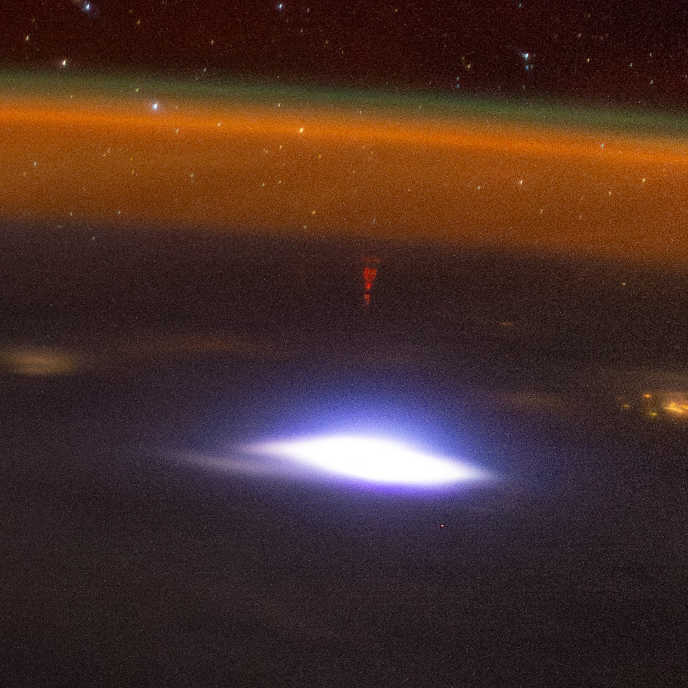](thumbnails/crop/iss047e007555.jpg "Full resolution will be uploaded to Flickr") | [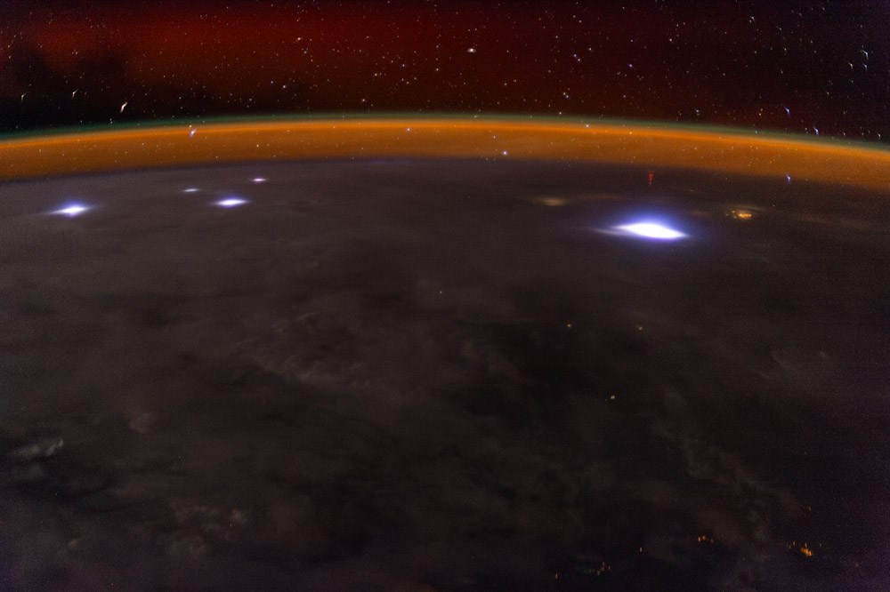](thumbnails/edit/iss047e007555.jpg "Full resolution will be uploaded to Flickr") | TLE Type: sprite    Astronaut: *Unknown* | [Full resolution](https://eol.jsc.nasa.gov/DatabaseImages/ESC/large/ISS047/ISS047-E-7555.JPG)    [Request Raw](https://eol.jsc.nasa.gov/SearchPhotos/RequestOriginalImage.pl?mission=ISS047&roll=E&frame=007555&file=iss047e007555.NEF) |
| [ISS053-E-13244](https://eol.jsc.nasa.gov/SearchPhotos/photo.pl?mission=ISS053&roll=E&frame=13244 "Link to the image listing") | [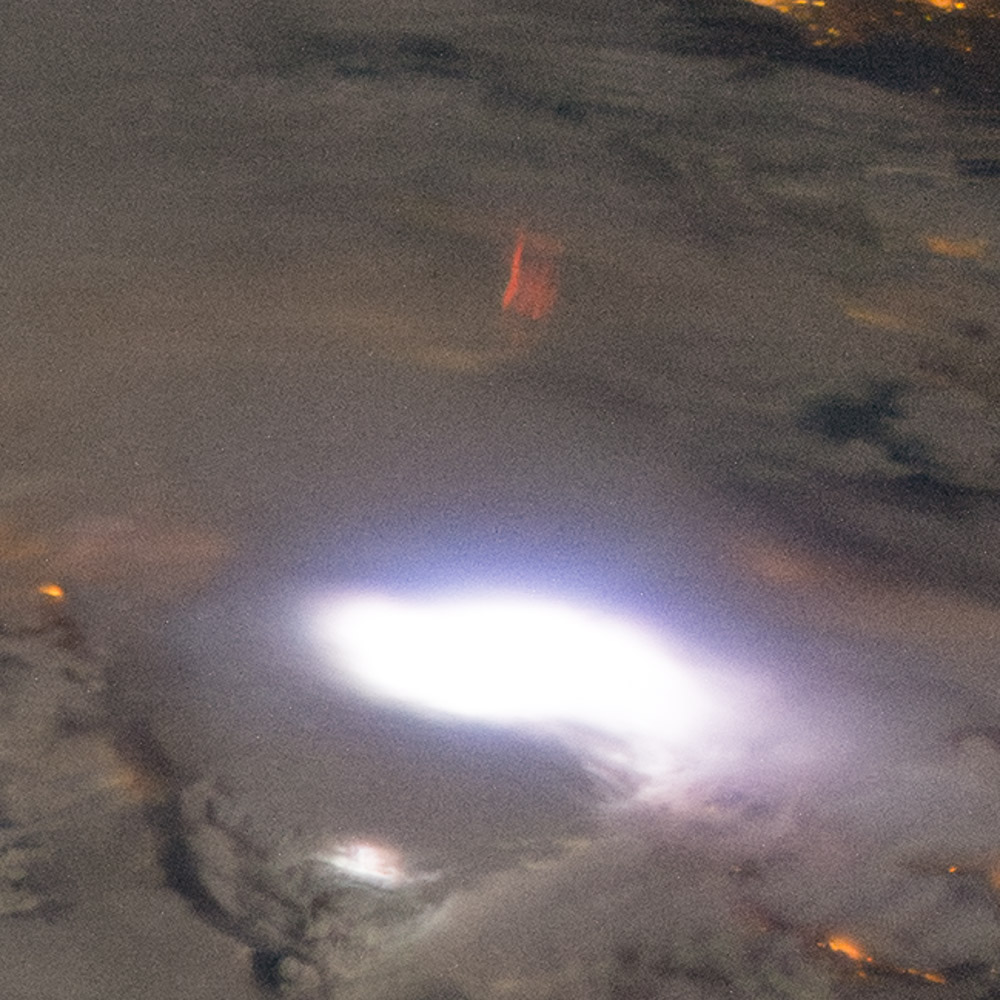](thumbnails/crop/iss053e013244.jpg "Full resolution will be uploaded to Flickr") | [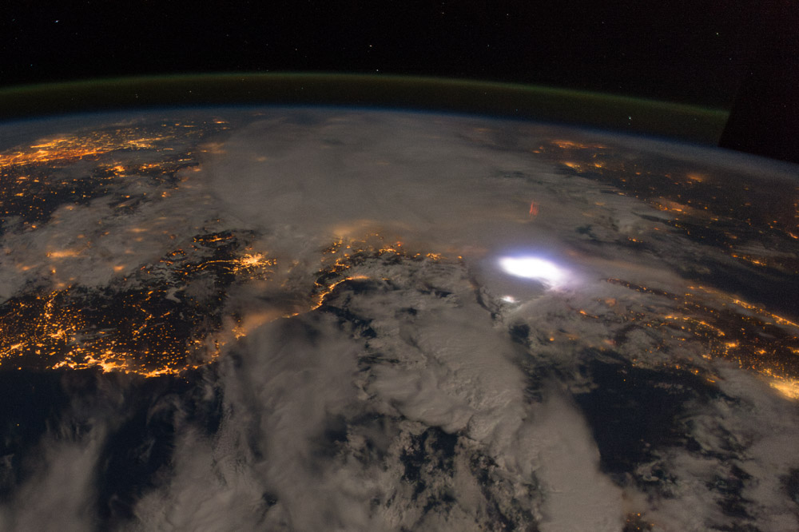](thumbnails/edit/iss053e013244.jpg "Full resolution will be uploaded to Flickr") | TLE Type: sprite    Astronaut: *Unknown* | [Full resolution](https://eol.jsc.nasa.gov/DatabaseImages/ESC/large/ISS053/ISS053-E-13244.JPG)    [Request Raw](https://eol.jsc.nasa.gov/SearchPhotos/RequestOriginalImage.pl?mission=ISS053&roll=E&frame=013244&file=iss053e013244.NEF) |
| [ISS053-E-148796](https://eol.jsc.nasa.gov/SearchPhotos/photo.pl?mission=ISS053&roll=E&frame=148796 "Link to the image listing") | [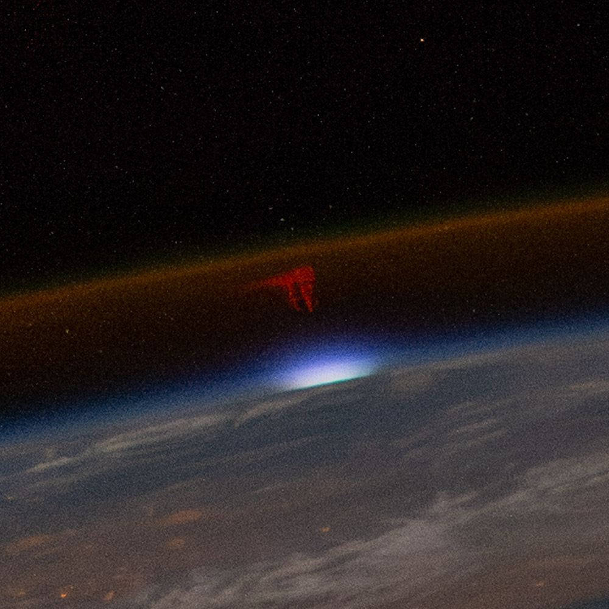](thumbnails/crop/iss053e148796.jpg "Full resolution will be uploaded to Flickr") | [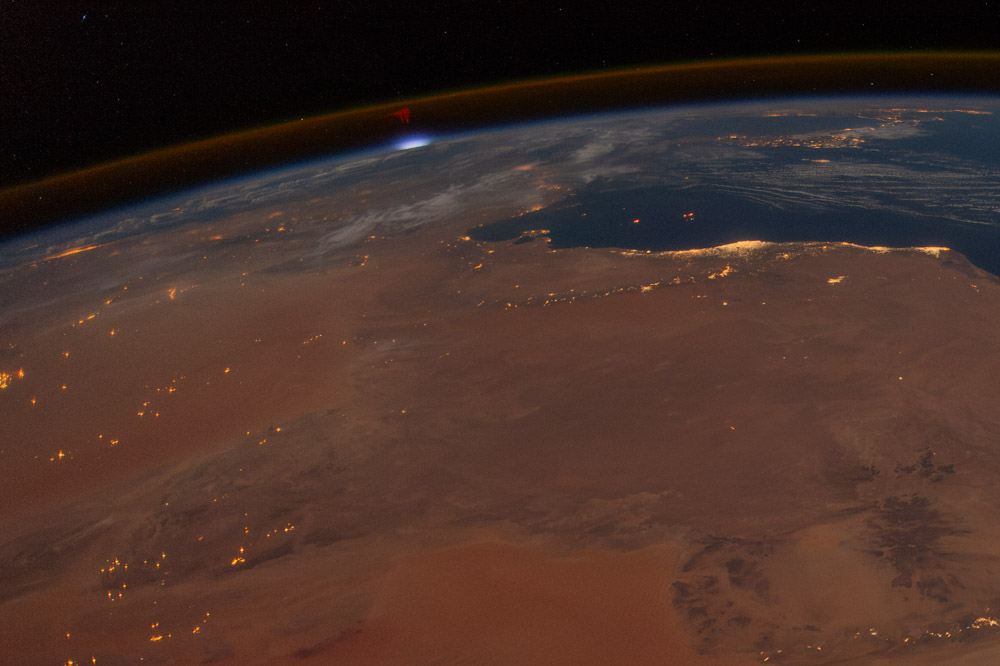](thumbnails/edit/iss053e148796.jpg "Full resolution will be uploaded to Flickr") | TLE Type: sprite    Astronaut: *Unknown* | [Full resolution](https://eol.jsc.nasa.gov/DatabaseImages/ESC/large/ISS053/ISS053-E-148796.JPG)    [Request Raw](https://eol.jsc.nasa.gov/SearchPhotos/RequestOriginalImage.pl?mission=ISS053&roll=E&frame=148796&file=iss053e148796.NEF) |
| [ISS053-E-162584](https://eol.jsc.nasa.gov/SearchPhotos/photo.pl?mission=ISS053&roll=E&frame=162584 "Link to the image listing") | [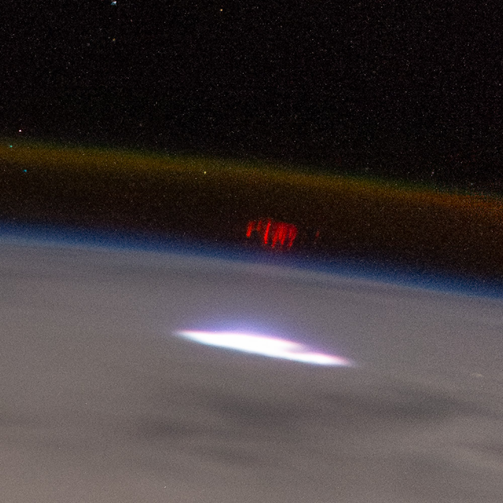](thumbnails/crop/iss053e162584.jpg "Full resolution will be uploaded to Flickr") | [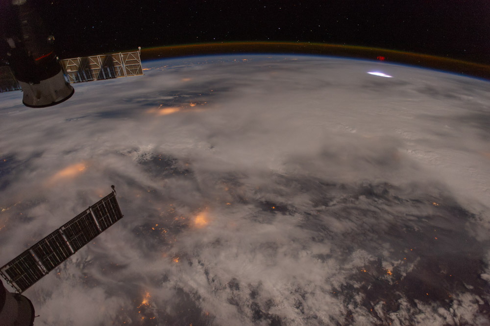](thumbnails/edit/iss053e162584.jpg "Full resolution will be uploaded to Flickr") | TLE Type: sprite    Astronaut: *Unknown* | [Full resolution](https://eol.jsc.nasa.gov/DatabaseImages/ESC/large/ISS053/ISS053-E-162584.JPG)    [Request Raw](https://eol.jsc.nasa.gov/SearchPhotos/RequestOriginalImage.pl?mission=ISS053&roll=E&frame=162584&file=iss053e162584.NEF) |
| [ISS053-E-56319](https://eol.jsc.nasa.gov/SearchPhotos/photo.pl?mission=ISS053&roll=E&frame=56319 "Link to the image listing") | [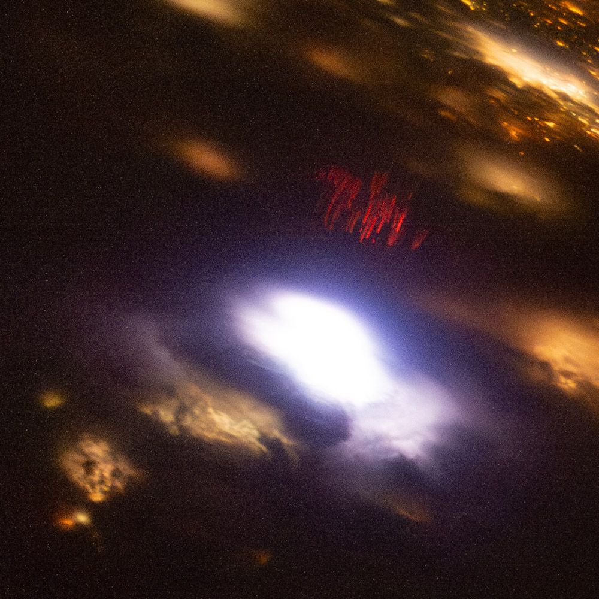](thumbnails/crop/iss053e056319.jpg "Full resolution will be uploaded to Flickr") | [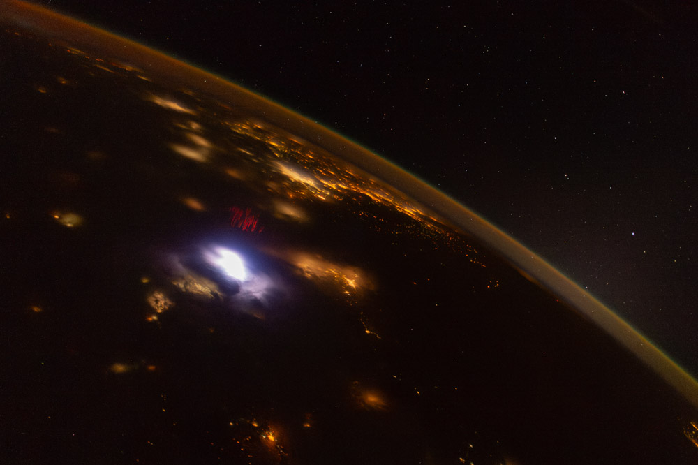](thumbnails/edit/iss053e056319.jpg "Full resolution will be uploaded to Flickr") | TLE Type: sprite    Astronaut: *Unknown* | [Full resolution](https://eol.jsc.nasa.gov/DatabaseImages/ESC/large/ISS053/ISS053-E-56319.JPG)    [Request Raw](https://eol.jsc.nasa.gov/SearchPhotos/RequestOriginalImage.pl?mission=ISS053&roll=E&frame=056319&file=iss053e056319.NEF) |
| [ISS059-E-60484](https://eol.jsc.nasa.gov/SearchPhotos/photo.pl?mission=ISS059&roll=E&frame=60484 "Link to the image listing") | [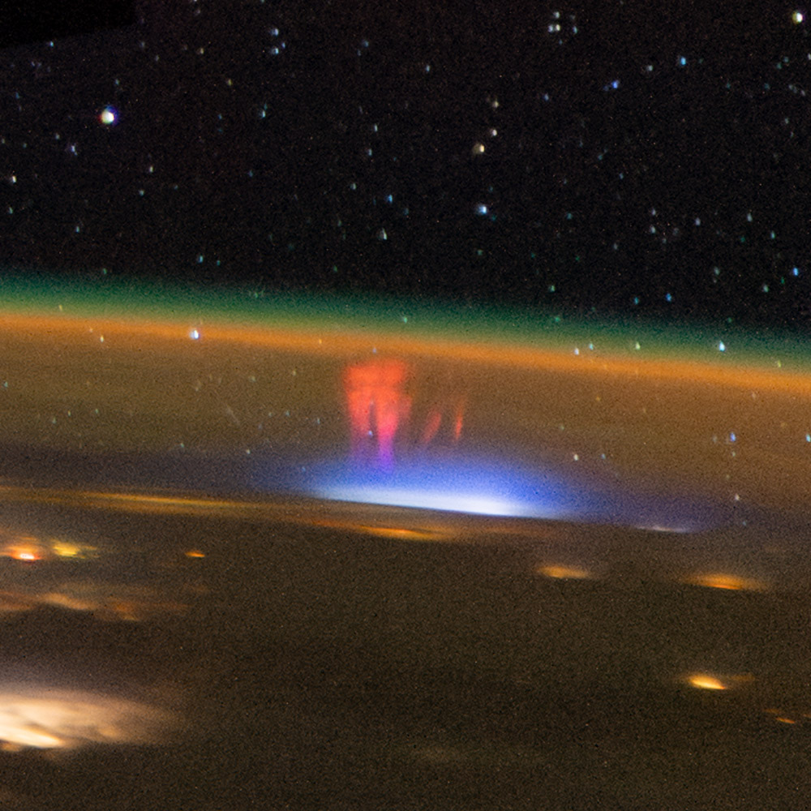](thumbnails/crop/iss059e060484.jpg "Full resolution will be uploaded to Flickr") | [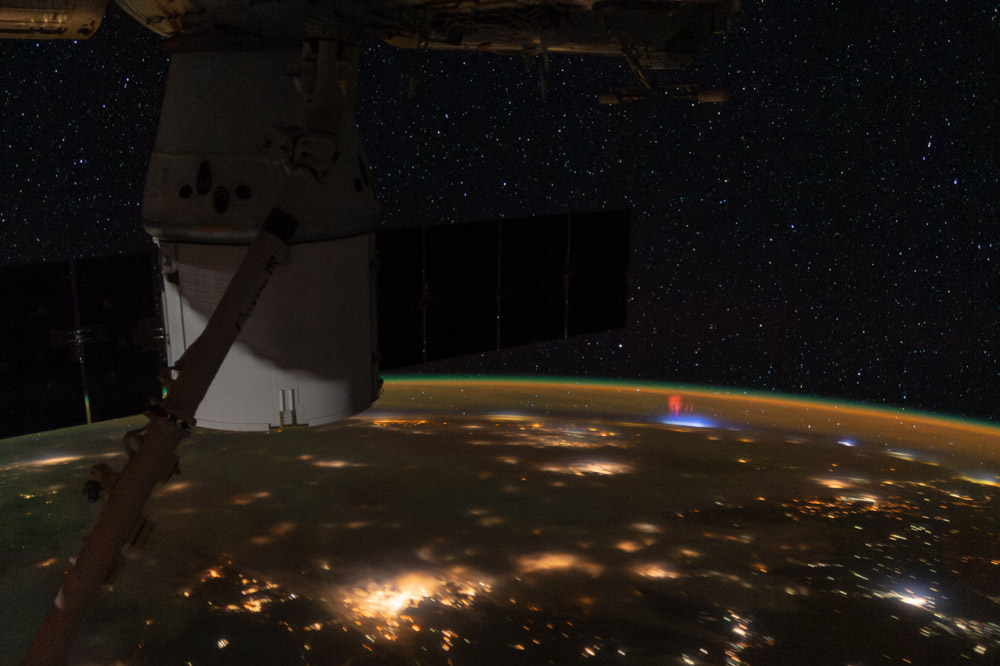](thumbnails/edit/iss059e060484.jpg "Full resolution will be uploaded to Flickr") | TLE Type: sprite    Astronaut: *Unknown* | [Full resolution](https://eol.jsc.nasa.gov/DatabaseImages/ESC/large/ISS059/ISS059-E-60484.JPG)    [Request Raw](https://eol.jsc.nasa.gov/SearchPhotos/RequestOriginalImage.pl?mission=ISS059&roll=E&frame=060484&file=iss059e060484.NEF) |
| [ISS059-E-60517](https://eol.jsc.nasa.gov/SearchPhotos/photo.pl?mission=ISS059&roll=E&frame=60517 "Link to the image listing") | [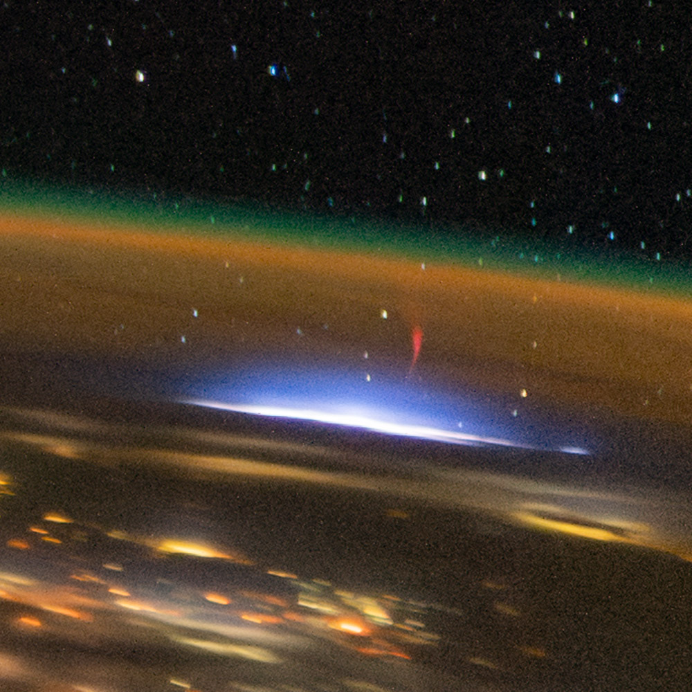](thumbnails/crop/iss059e060517.jpg "Full resolution will be uploaded to Flickr") | [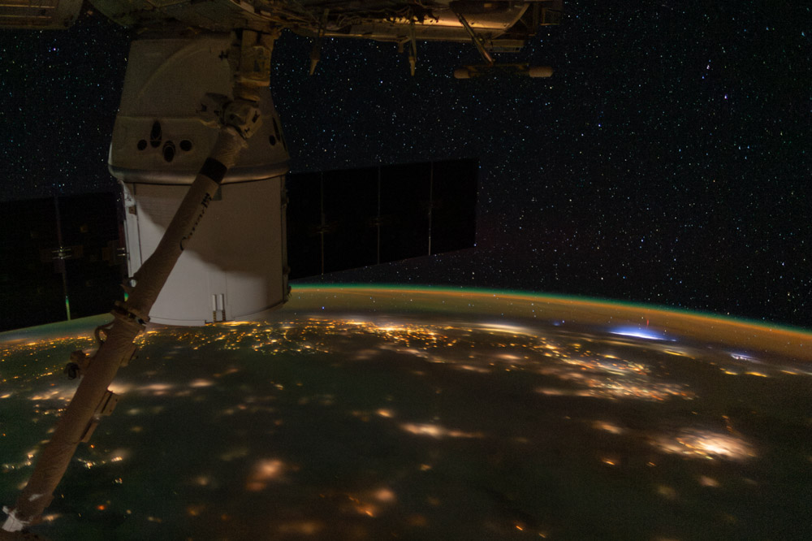](thumbnails/edit/iss059e060517.jpg "Full resolution will be uploaded to Flickr") | TLE Type: sprite    Astronaut: *Unknown* | [Full resolution](https://eol.jsc.nasa.gov/DatabaseImages/ESC/large/ISS059/ISS059-E-60517.JPG)    [Request Raw](https://eol.jsc.nasa.gov/SearchPhotos/RequestOriginalImage.pl?mission=ISS059&roll=E&frame=060517&file=iss059e060517.NEF) |
| [ISS065-E-392805](https://eol.jsc.nasa.gov/SearchPhotos/photo.pl?mission=ISS065&roll=E&frame=392805 "Link to the image listing") | [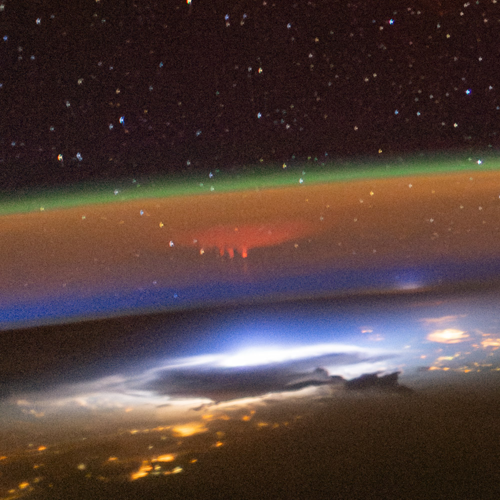](thumbnails/crop/iss065e392805.jpg "Full resolution will be uploaded to Flickr") | [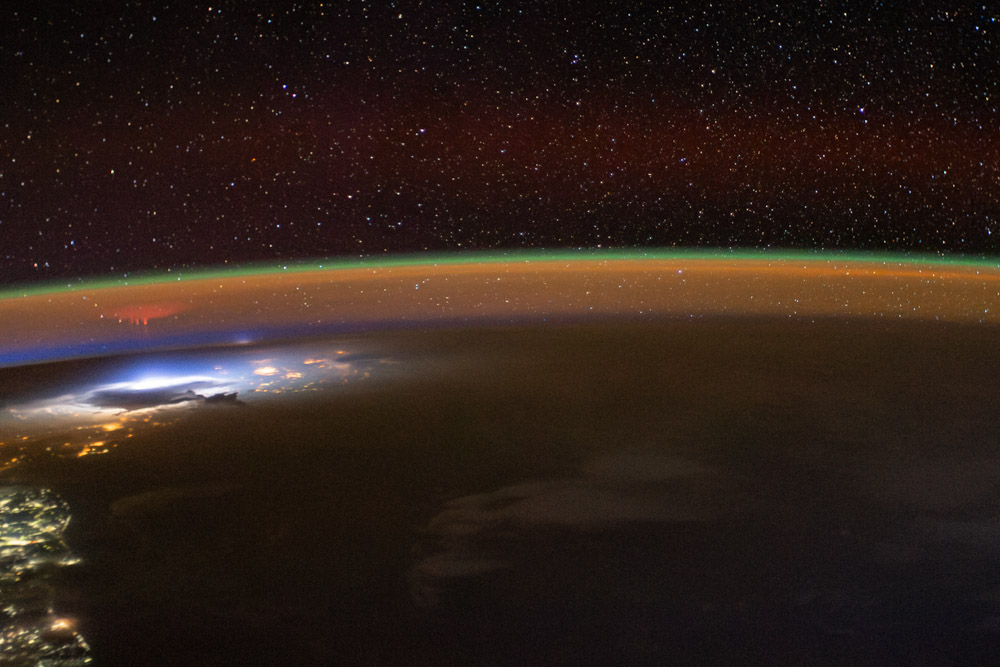](thumbnails/edit/iss065e392805.jpg "Full resolution will be uploaded to Flickr") | TLE Type: sprite, halo    Astronaut: Megan McArthur | [Full resolution](https://eol.jsc.nasa.gov/DatabaseImages/ESC/large/ISS065/ISS065-E-392805.JPG)    [Request Raw](https://eol.jsc.nasa.gov/SearchPhotos/RequestOriginalImage.pl?mission=ISS065&roll=E&frame=392805&file=iss065e392805.NEF) |
| [ISS065-E-394522](https://eol.jsc.nasa.gov/SearchPhotos/photo.pl?mission=ISS065&roll=E&frame=394522 "Link to the image listing") | [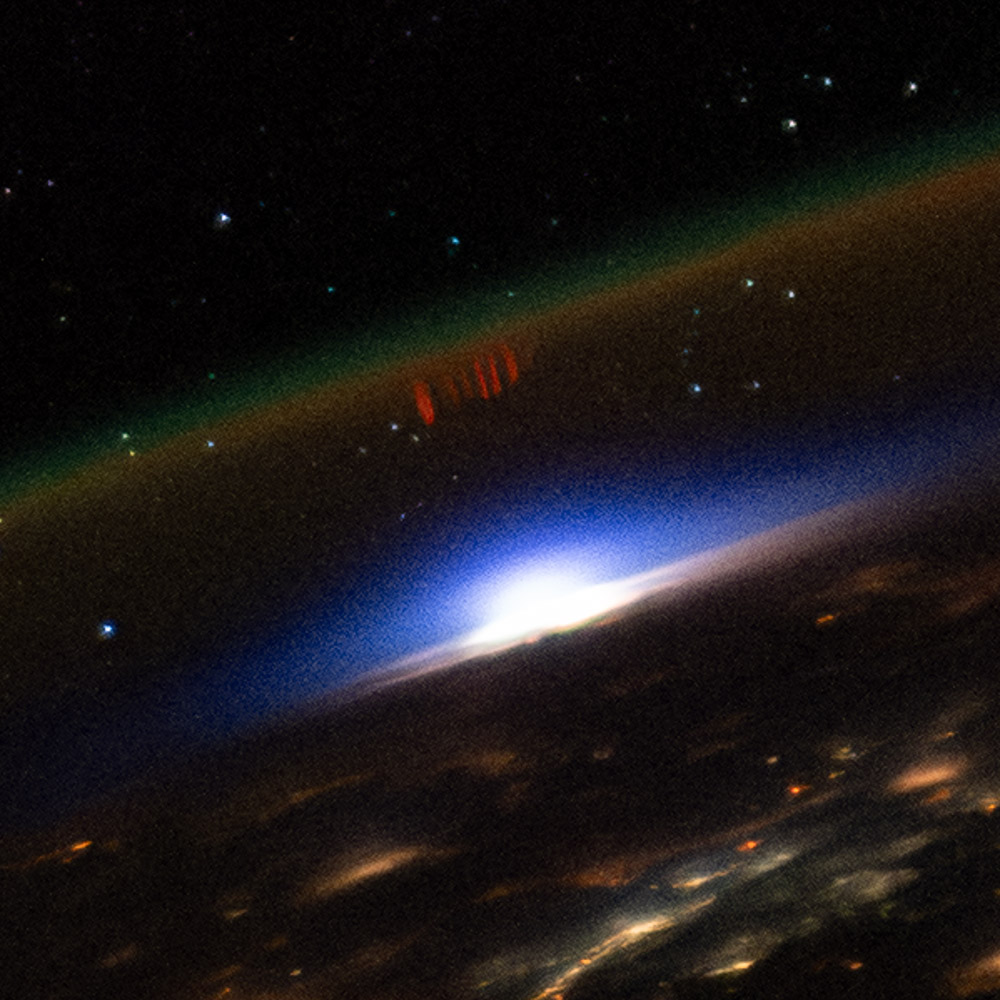](thumbnails/crop/iss065e394522.jpg "Full resolution will be uploaded to Flickr") | [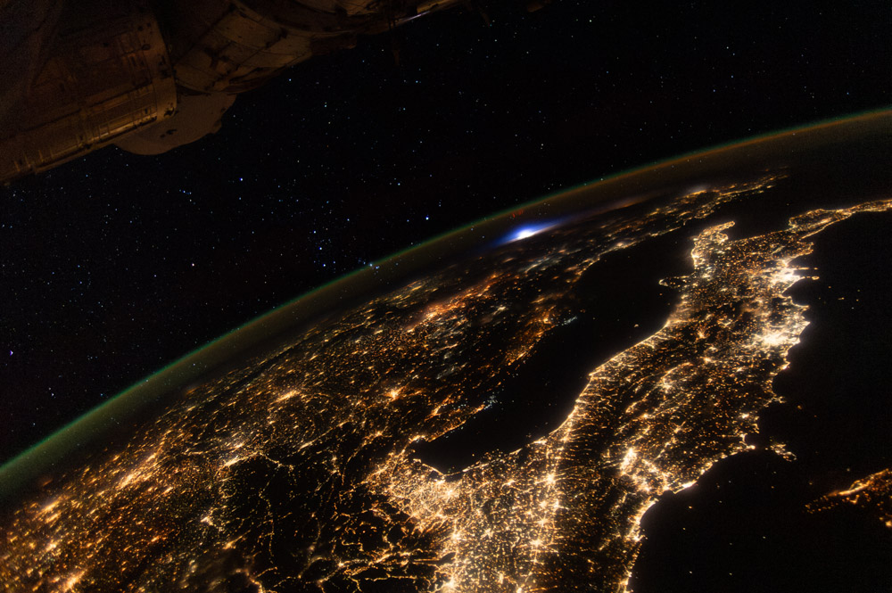](thumbnails/edit/iss065e394522.jpg "Full resolution will be uploaded to Flickr") | TLE Type: sprite, halo    Astronaut: Thomas Pesquet | [Full resolution](https://eol.jsc.nasa.gov/DatabaseImages/ESC/large/ISS065/ISS065-E-394522.JPG)    [Request Raw](https://eol.jsc.nasa.gov/SearchPhotos/RequestOriginalImage.pl?mission=ISS065&roll=E&frame=394522&file=iss065e394522.NEF) |
| [ISS066-E-24523](https://eol.jsc.nasa.gov/SearchPhotos/photo.pl?mission=ISS066&roll=E&frame=24523 "Link to the image listing") | [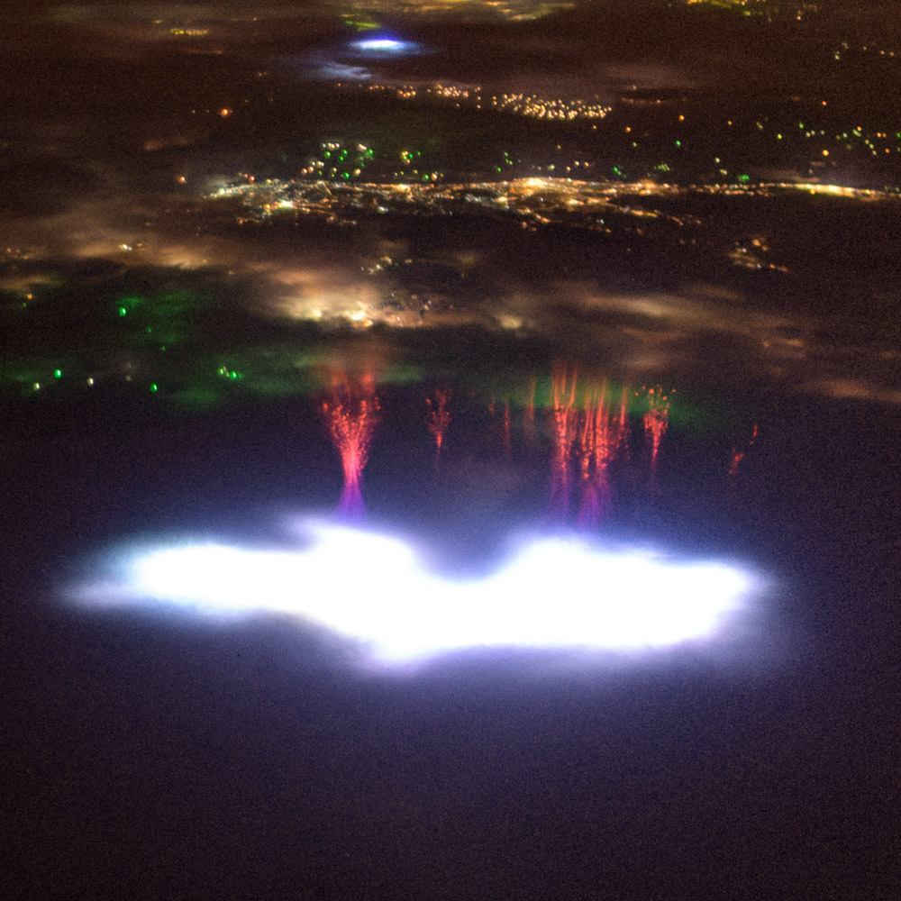](thumbnails/crop/iss066e024523.jpg "Full resolution will be uploaded to Flickr") | [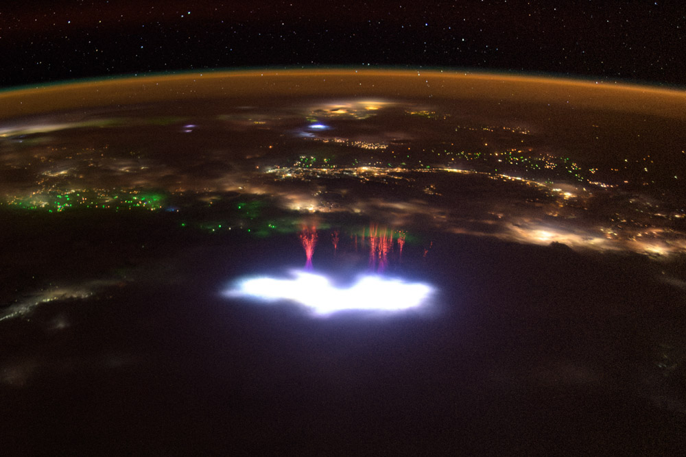](thumbnails/edit/iss066e024523.jpg "Full resolution will be uploaded to Flickr") | TLE Type: sprite    Astronaut: Thomas Pesquet | [Full resolution](https://eol.jsc.nasa.gov/DatabaseImages/ESC/large/ISS066/ISS066-E-24523.JPG)    [Request Raw](https://eol.jsc.nasa.gov/SearchPhotos/RequestOriginalImage.pl?mission=ISS066&roll=E&frame=024523&file=iss066e024523.NEF) |
| [ISS066-E-24524](https://eol.jsc.nasa.gov/SearchPhotos/photo.pl?mission=ISS066&roll=E&frame=24524 "Link to the image listing") | [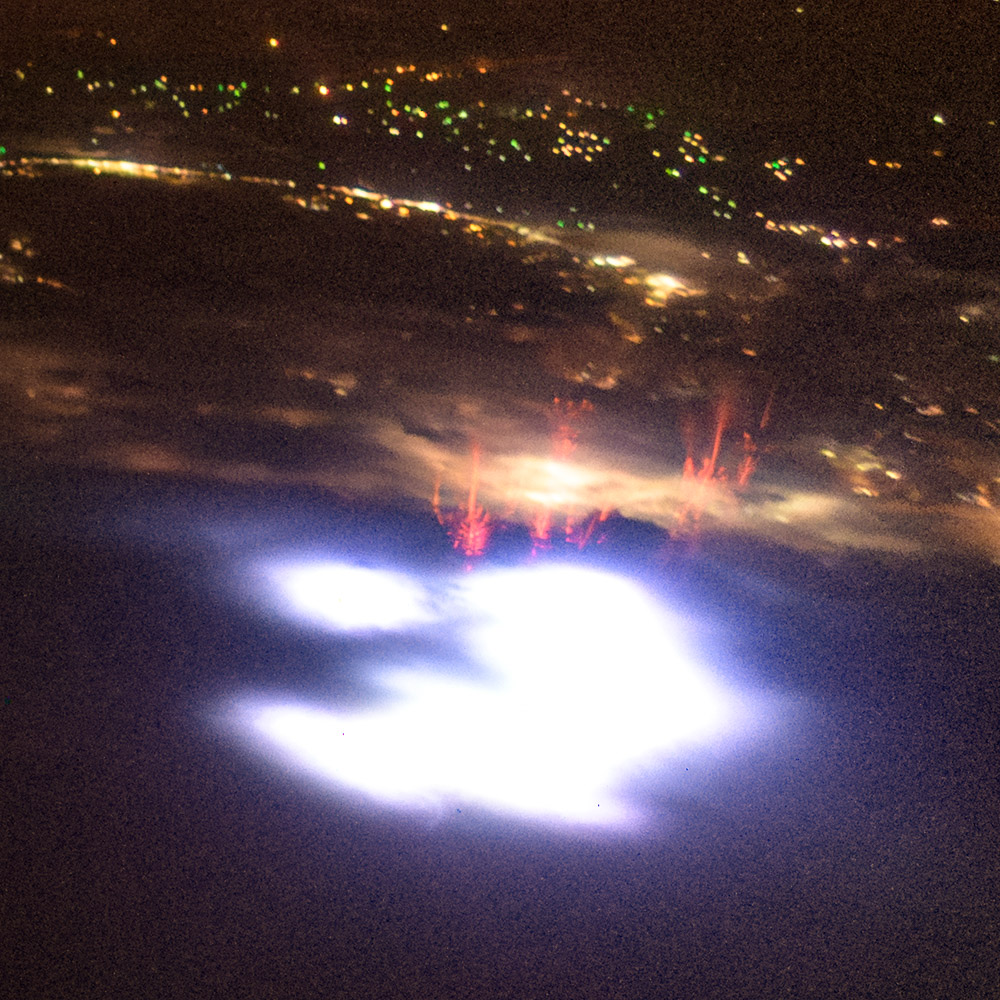](thumbnails/crop/iss066e024524.jpg "Full resolution will be uploaded to Flickr") | [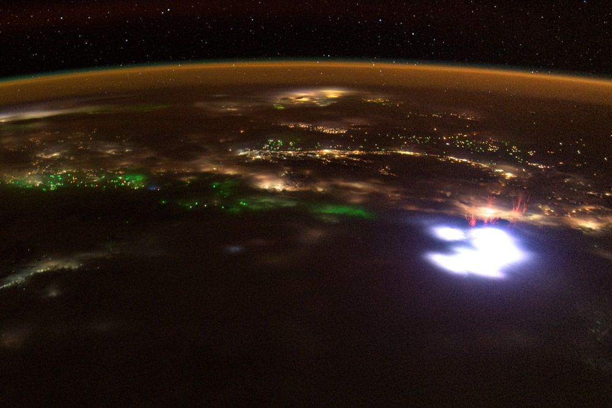](thumbnails/edit/iss066e024524.jpg "Full resolution will be uploaded to Flickr") | TLE Type: sprite    Astronaut: Thomas Pesquet | [Full resolution](https://eol.jsc.nasa.gov/DatabaseImages/ESC/large/ISS066/ISS066-E-24524.JPG)    [Request Raw](https://eol.jsc.nasa.gov/SearchPhotos/RequestOriginalImage.pl?mission=ISS066&roll=E&frame=024524&file=iss066e024524.NEF) |
| [ISS067-E-364481](https://eol.jsc.nasa.gov/SearchPhotos/photo.pl?mission=ISS067&roll=E&frame=364481 "Link to the image listing") | [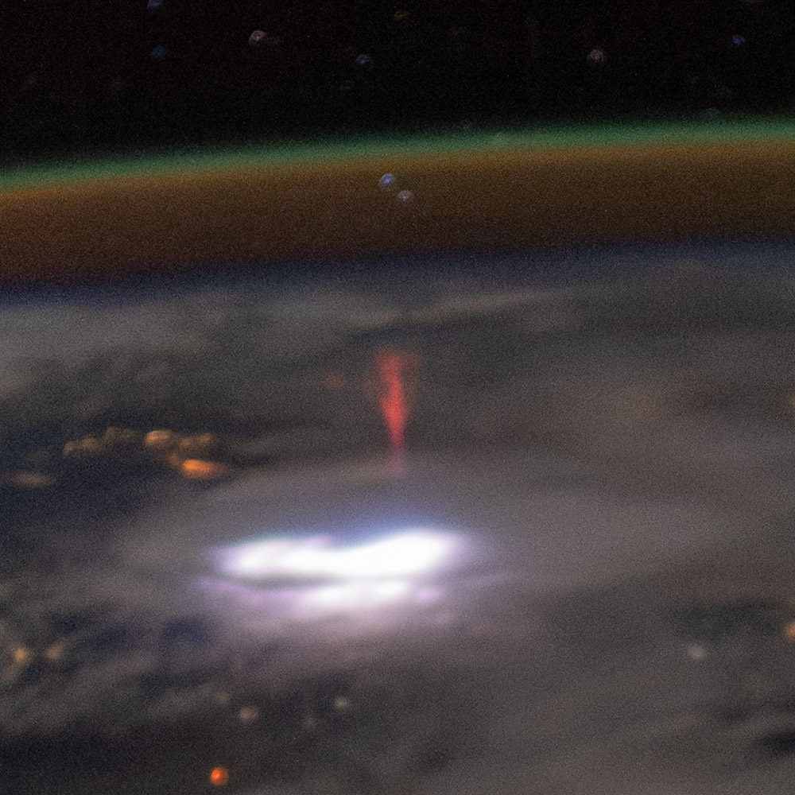](thumbnails/crop/iss067e364481.jpg "Full resolution will be uploaded to Flickr") | [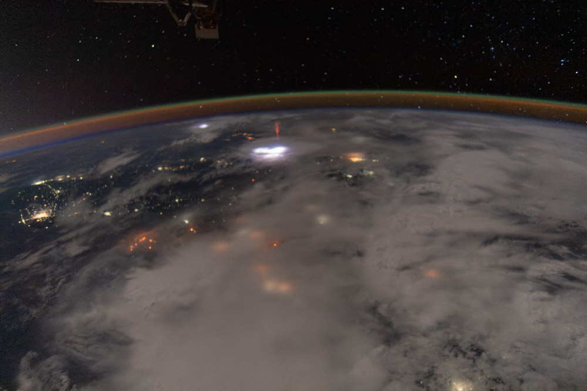](thumbnails/edit/iss067e364481.jpg "Full resolution will be uploaded to Flickr") | TLE Type: sprite    Astronaut: Kjell Lindgren | [Full resolution](https://eol.jsc.nasa.gov/DatabaseImages/ESC/large/ISS067/ISS067-E-364481.JPG)    [Request Raw](https://eol.jsc.nasa.gov/SearchPhotos/RequestOriginalImage.pl?mission=ISS067&roll=E&frame=364481&file=iss067e364481.NEF) |
| [ISS068-E-1000](https://eol.jsc.nasa.gov/SearchPhotos/photo.pl?mission=ISS068&roll=E&frame=1000 "Link to the image listing") | [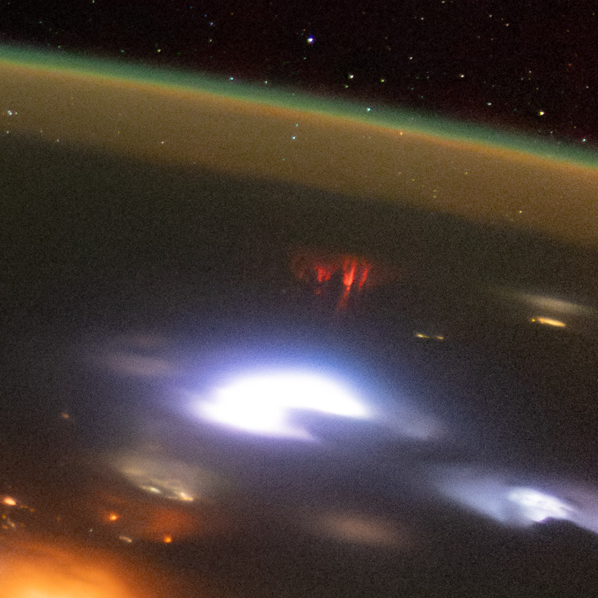](thumbnails/crop/iss068e001000.jpg "Full resolution will be uploaded to Flickr") |  | TLE Type: sprite    Astronaut: *Unknown* | [Full resolution](https://eol.jsc.nasa.gov/DatabaseImages/ESC/large/ISS068/ISS068-E-1000.JPG)    [Request Raw](https://eol.jsc.nasa.gov/SearchPhotos/RequestOriginalImage.pl?mission=ISS068&roll=E&frame=001000&file=iss068e001000.NEF) |
| [ISS071-E-170351](https://eol.jsc.nasa.gov/SearchPhotos/photo.pl?mission=ISS071&roll=E&frame=170351 "Link to the image listing") | [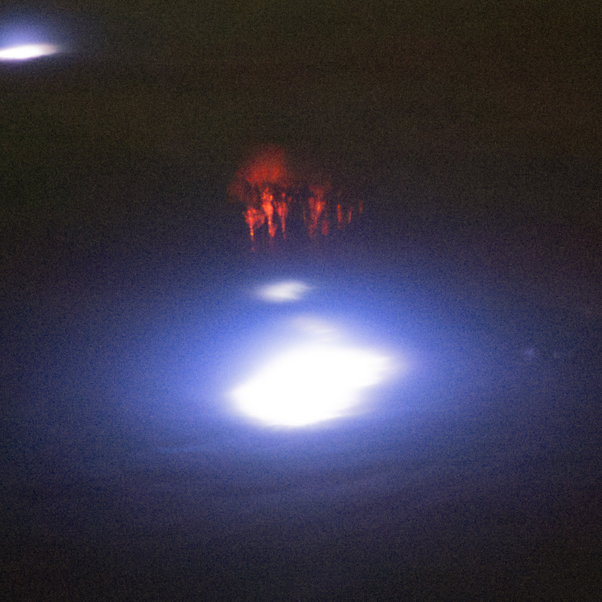](thumbnails/crop/iss071e170351.jpg "Full resolution will be uploaded to Flickr") | [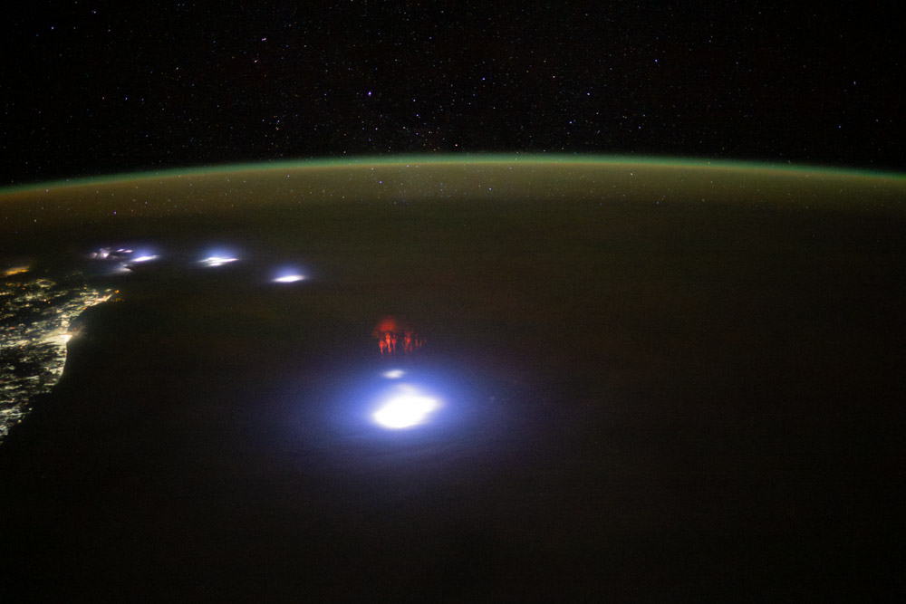](thumbnails/edit/iss071e170351.jpg "Full resolution will be uploaded to Flickr") | TLE Type: sprite    Astronaut: Matthew Dominick | [Full resolution](https://eol.jsc.nasa.gov/DatabaseImages/ESC/large/ISS071/ISS071-E-170351.JPG)    [Request Raw](https://eol.jsc.nasa.gov/SearchPhotos/RequestOriginalImage.pl?mission=ISS071&roll=E&frame=170351&file=iss071e170351.NEF) |
| [ISS071-E-170356](https://eol.jsc.nasa.gov/SearchPhotos/photo.pl?mission=ISS071&roll=E&frame=170356 "Link to the image listing") | [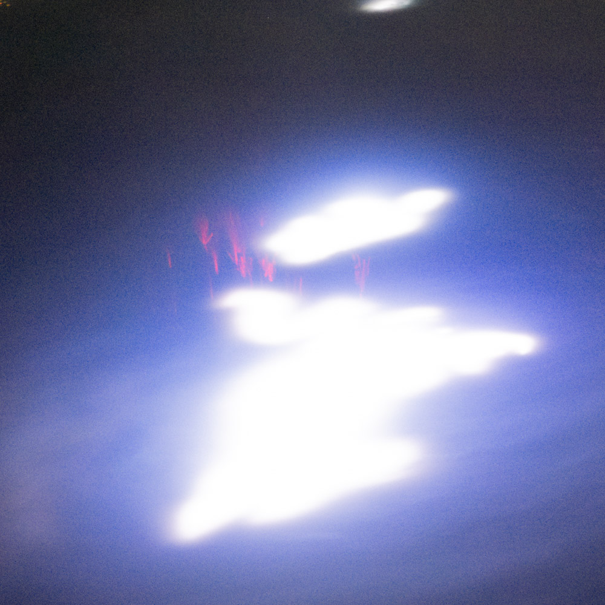](thumbnails/crop/iss071e170356.jpg "Full resolution will be uploaded to Flickr") | [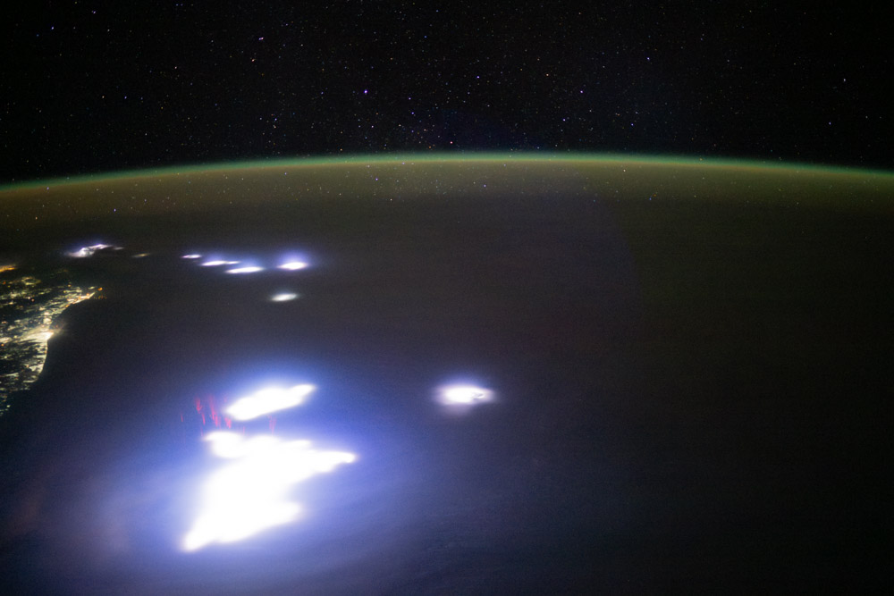](thumbnails/edit/iss071e170356.jpg "Full resolution will be uploaded to Flickr") | TLE Type: sprite    Astronaut: Matthew Dominick | [Full resolution](https://eol.jsc.nasa.gov/DatabaseImages/ESC/large/ISS071/ISS071-E-170356.JPG)    [Request Raw](https://eol.jsc.nasa.gov/SearchPhotos/RequestOriginalImage.pl?mission=ISS071&roll=E&frame=170356&file=iss071e170356.NEF) |
| [ISS071-E-234765](https://eol.jsc.nasa.gov/SearchPhotos/photo.pl?mission=ISS071&roll=E&frame=234765 "Link to the image listing") | [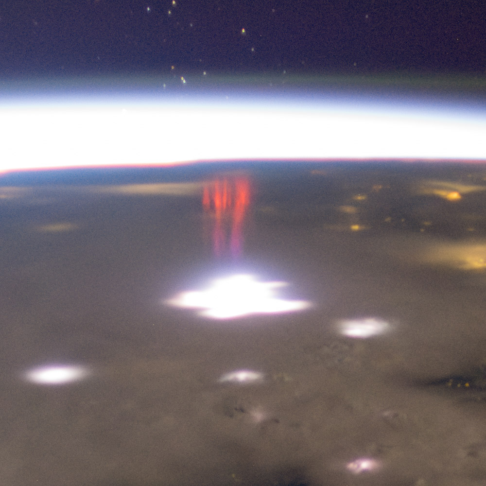](thumbnails/crop/iss071e234765.jpg "Full resolution will be uploaded to Flickr") | [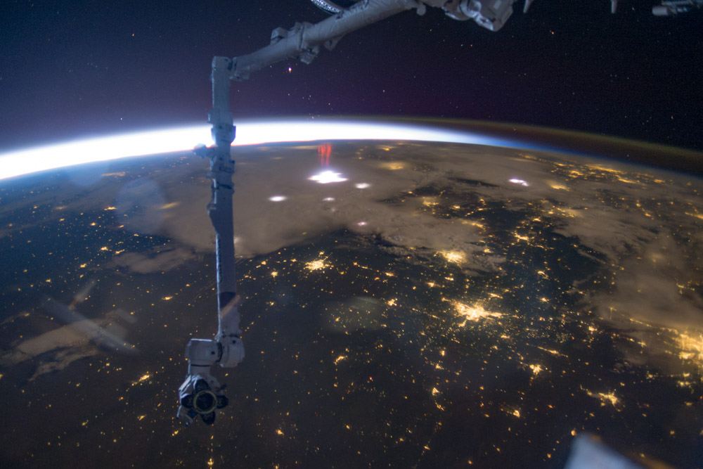](thumbnails/edit/iss071e234765.jpg "Full resolution will be uploaded to Flickr") | TLE Type: sprite    Astronaut: Butch Wilmore | [Full resolution](https://eol.jsc.nasa.gov/DatabaseImages/ESC/large/ISS071/ISS071-E-234765.JPG)    [Request Raw](https://eol.jsc.nasa.gov/SearchPhotos/RequestOriginalImage.pl?mission=ISS071&roll=E&frame=234765&file=iss071e234765.NEF) |
| [ISS071-E-319414](https://eol.jsc.nasa.gov/SearchPhotos/photo.pl?mission=ISS071&roll=E&frame=319414 "Link to the image listing") | [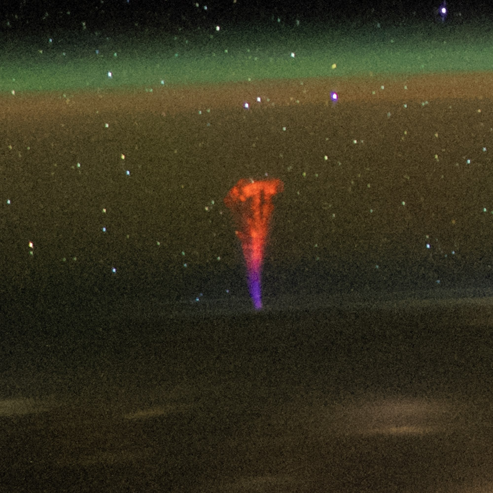](thumbnails/crop/iss071e319414.jpg "Full resolution will be uploaded to Flickr") | [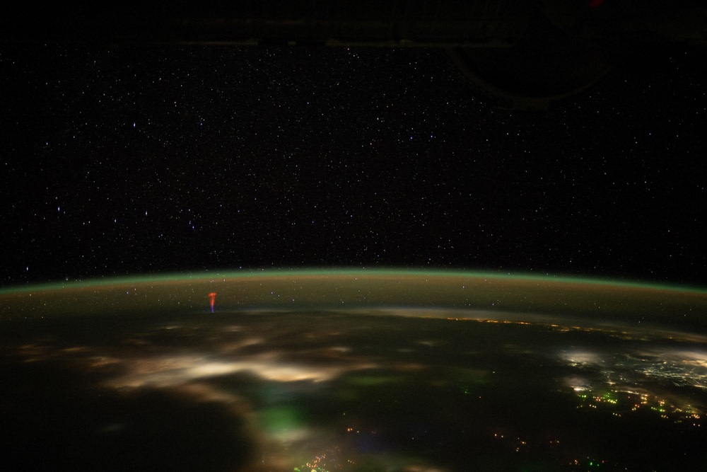](thumbnails/edit/iss071e319414.jpg "Full resolution will be uploaded to Flickr") | TLE Type: gigantic_jet    Astronaut: Matthew Dominick | [Full resolution](https://eol.jsc.nasa.gov/DatabaseImages/ESC/large/ISS071/ISS071-E-319414.JPG)    [Request Raw](https://eol.jsc.nasa.gov/SearchPhotos/RequestOriginalImage.pl?mission=ISS071&roll=E&frame=319414&file=iss071e319414.NEF) |
| [ISS072-E-118384](https://eol.jsc.nasa.gov/SearchPhotos/photo.pl?mission=ISS072&roll=E&frame=118384 "Link to the image listing") | [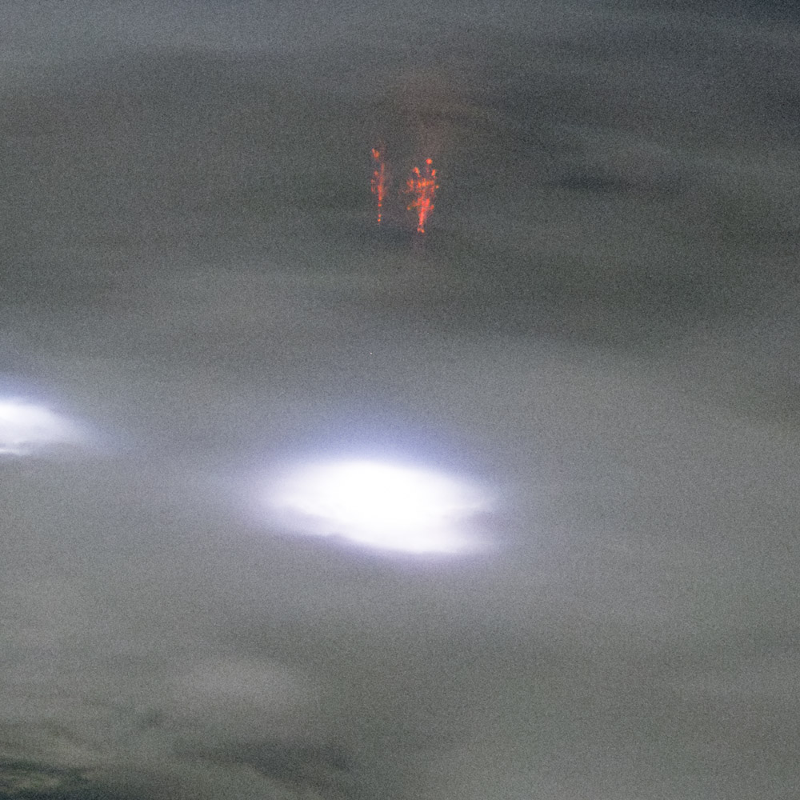](thumbnails/crop/iss072e118384.jpg "Full resolution will be uploaded to Flickr") | [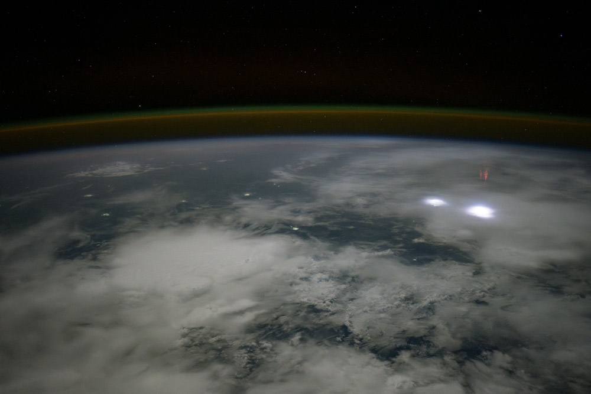](thumbnails/edit/iss072e118384.jpg "Full resolution will be uploaded to Flickr") | TLE Type: sprite    Astronaut: Matthew Dominick | [Full resolution](https://eol.jsc.nasa.gov/DatabaseImages/ESC/large/ISS072/ISS072-E-118384.JPG)    [Request Raw](https://eol.jsc.nasa.gov/SearchPhotos/RequestOriginalImage.pl?mission=ISS072&roll=E&frame=118384&file=iss072e118384.NEF) |
| [ISS072-E-118493](https://eol.jsc.nasa.gov/SearchPhotos/photo.pl?mission=ISS072&roll=E&frame=118493 "Link to the image listing") | [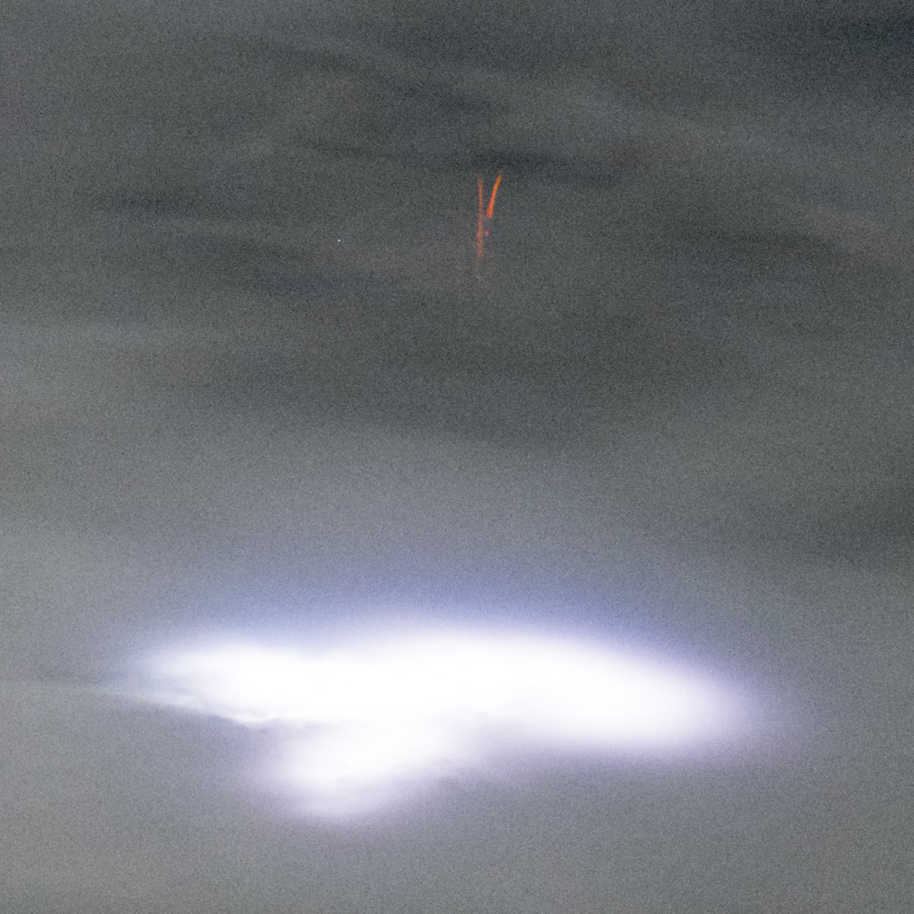](thumbnails/crop/iss072e118493.jpg "Full resolution will be uploaded to Flickr") |  | TLE Type: sprite    Astronaut: Matthew Dominick | [Full resolution](https://eol.jsc.nasa.gov/DatabaseImages/ESC/large/ISS072/ISS072-E-118493.JPG)    [Request Raw](https://eol.jsc.nasa.gov/SearchPhotos/RequestOriginalImage.pl?mission=ISS072&roll=E&frame=118493&file=iss072e118493.NEF) |
| [ISS072-E-262468](https://eol.jsc.nasa.gov/SearchPhotos/photo.pl?mission=ISS072&roll=E&frame=262468 "Link to the image listing") | [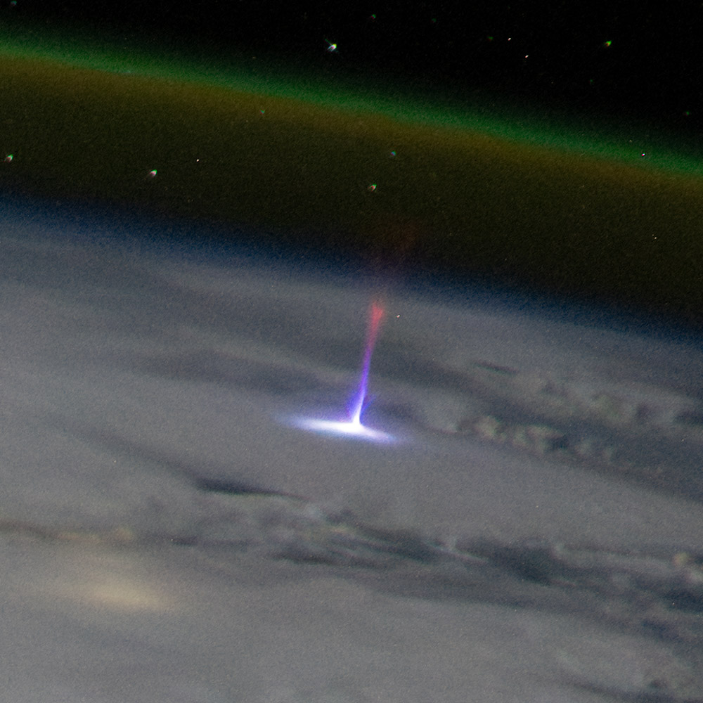](thumbnails/crop/iss072e262468.jpg "Full resolution will be uploaded to Flickr") | [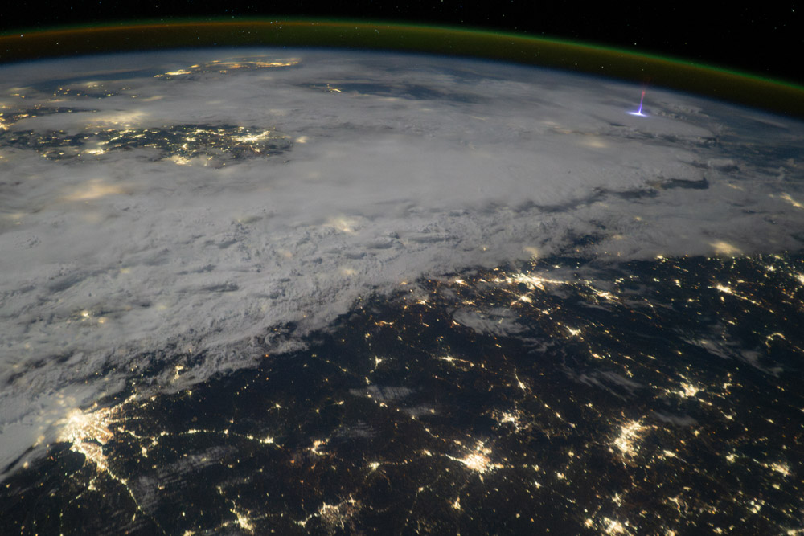](thumbnails/edit/iss072e262468.jpg "Full resolution will be uploaded to Flickr") | TLE Type: gigantic_jet    Astronaut: Butch Wilmore | [Full resolution](https://eol.jsc.nasa.gov/DatabaseImages/ESC/large/ISS072/ISS072-E-262468.JPG)    [Request Raw](https://eol.jsc.nasa.gov/SearchPhotos/RequestOriginalImage.pl?mission=ISS072&roll=E&frame=262468&file=iss072e262468.NEF) |
| [ISS073-E-151533](https://eol.jsc.nasa.gov/SearchPhotos/photo.pl?mission=ISS073&roll=E&frame=151533 "Link to the image listing") | [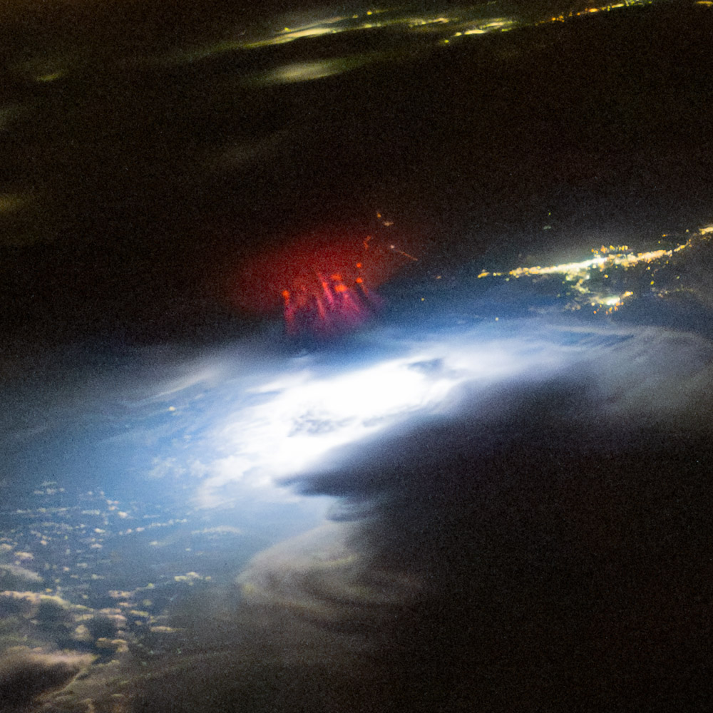](thumbnails/crop/iss073e0151533.jpg "Full resolution will be uploaded to Flickr") | [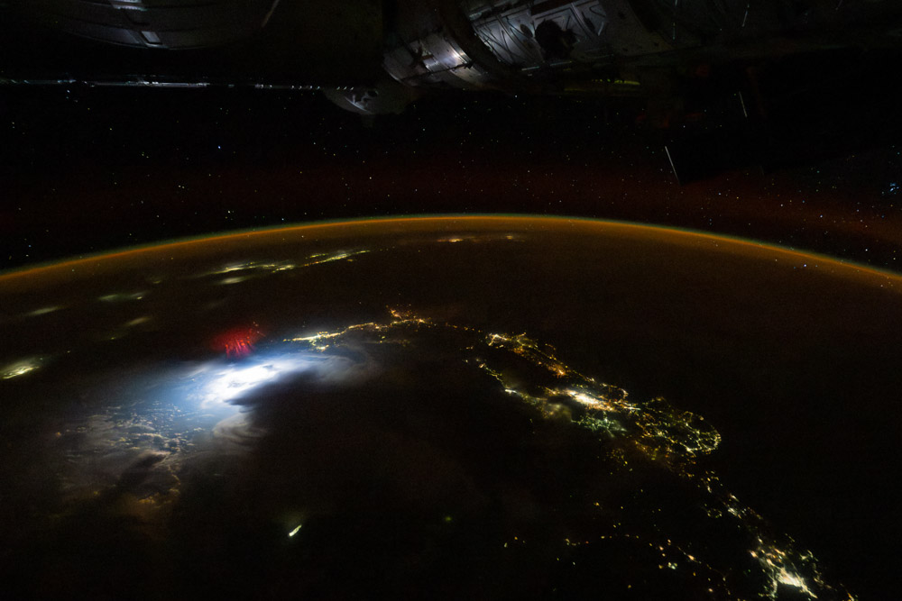](thumbnails/edit/iss073e0151533.jpg "Full resolution will be uploaded to Flickr") | TLE Type: sprite, halo    Astronaut: Nichole Ayers | [Full resolution](https://eol.jsc.nasa.gov/DatabaseImages/ESC/large/ISS073/ISS073-E-151533.JPG)    [Request Raw](https://eol.jsc.nasa.gov/SearchPhotos/RequestOriginalImage.pl?mission=ISS073&roll=E&frame=151533&file=iss073e0151533.NEF) |
| [ISS073-E-206244](https://eol.jsc.nasa.gov/SearchPhotos/photo.pl?mission=ISS073&roll=E&frame=206244 "Link to the image listing") | [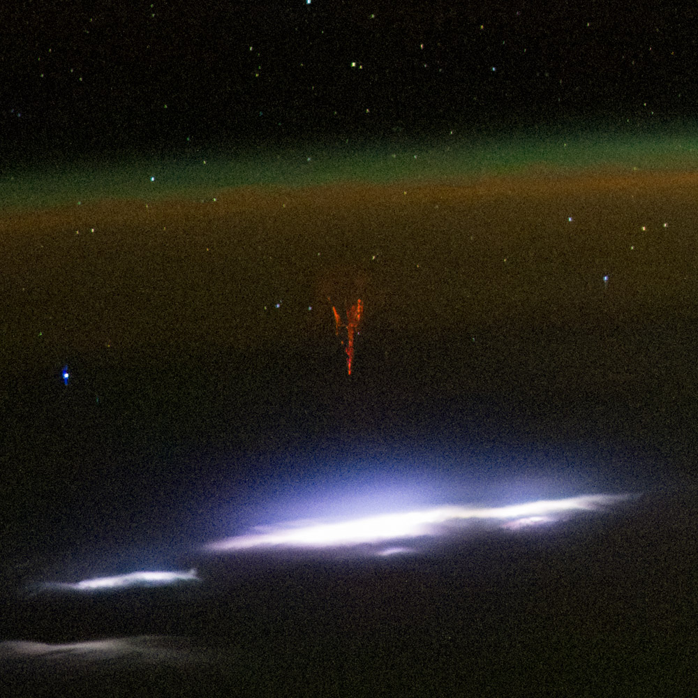](thumbnails/crop/iss073e0206244.jpg "Full resolution will be uploaded to Flickr") | [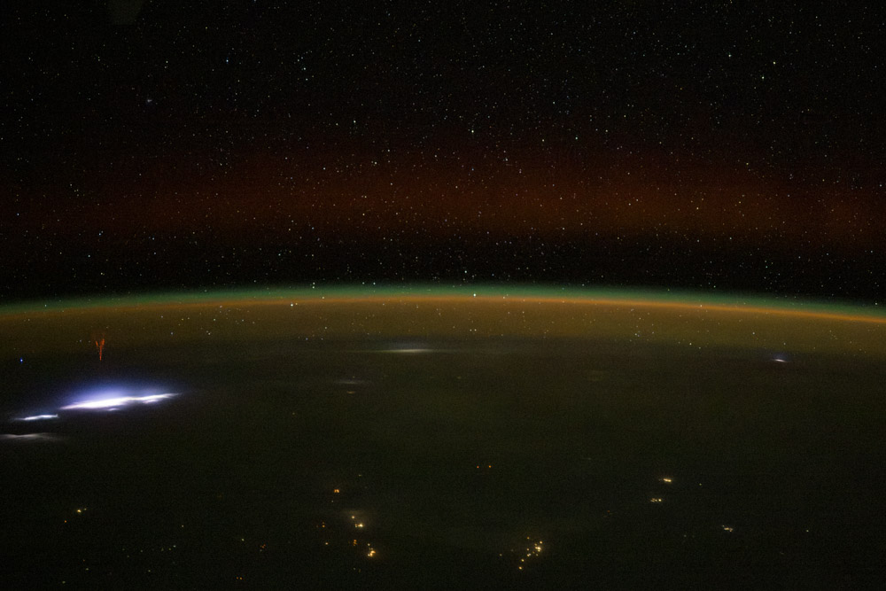](thumbnails/edit/iss073e0206244.jpg "Full resolution will be uploaded to Flickr") | TLE Type: sprite    Astronaut: Anne McClain | [Full resolution](https://eol.jsc.nasa.gov/DatabaseImages/ESC/large/ISS073/ISS073-E-206244.JPG)    [Request Raw](https://eol.jsc.nasa.gov/SearchPhotos/RequestOriginalImage.pl?mission=ISS073&roll=E&frame=206244&file=iss073e0206244.NEF) |
| [ISS073-E-208142](https://eol.jsc.nasa.gov/SearchPhotos/photo.pl?mission=ISS073&roll=E&frame=208142 "Link to the image listing") | [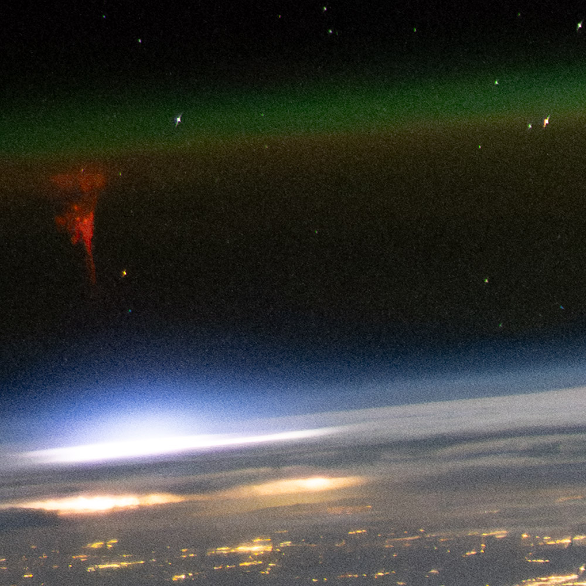](thumbnails/crop/iss073e0208142.jpg "Full resolution will be uploaded to Flickr") | [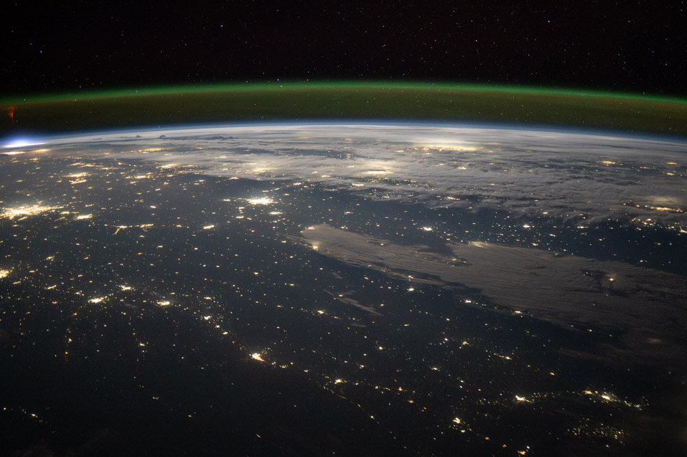](thumbnails/edit/iss073e0208142.jpg "Full resolution will be uploaded to Flickr") | TLE Type: sprite    Astronaut: Nichole Ayers | [Full resolution](https://eol.jsc.nasa.gov/DatabaseImages/ESC/large/ISS073/ISS073-E-208142.JPG)    [Request Raw](https://eol.jsc.nasa.gov/SearchPhotos/RequestOriginalImage.pl?mission=ISS073&roll=E&frame=208142&file=iss073e0208142.NEF) |
| [ISS073-E-260125](https://eol.jsc.nasa.gov/SearchPhotos/photo.pl?mission=ISS073&roll=E&frame=260125 "Link to the image listing") | [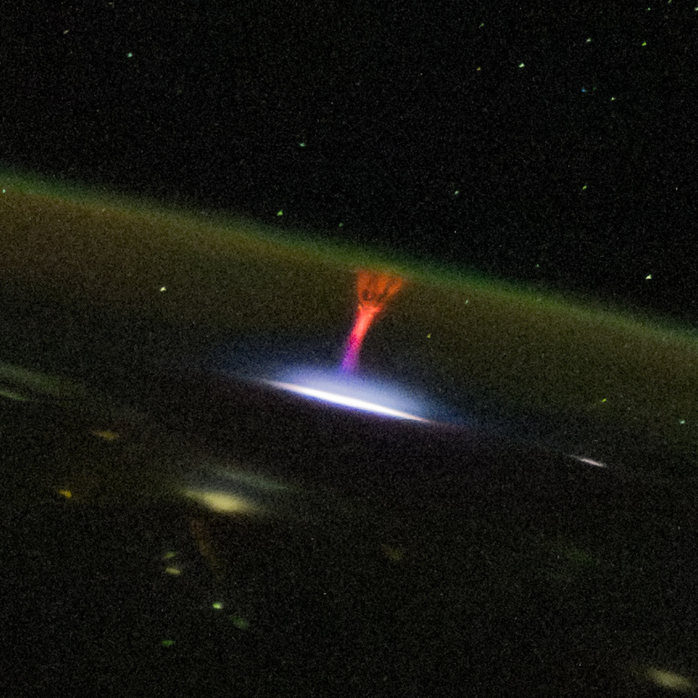](thumbnails/crop/iss073e0260125.jpg "Full resolution will be uploaded to Flickr") | [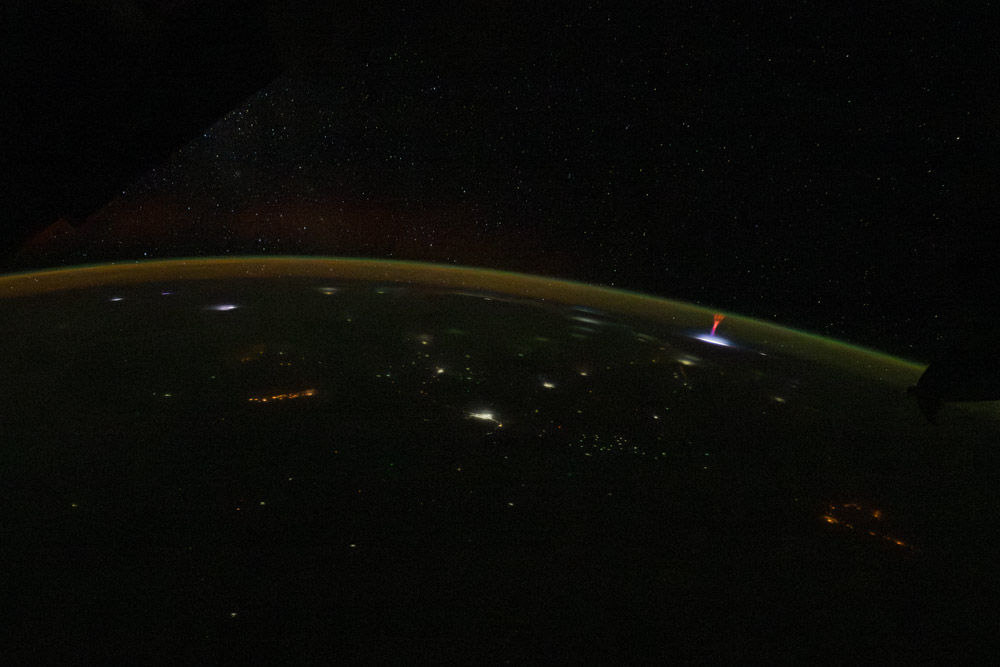](thumbnails/edit/iss073e0260125.jpg "Full resolution will be uploaded to Flickr") | TLE Type: sprite    Astronaut: Anne McClain | [Full resolution](https://eol.jsc.nasa.gov/DatabaseImages/ESC/large/ISS073/ISS073-E-260125.JPG)    [Request Raw](https://eol.jsc.nasa.gov/SearchPhotos/RequestOriginalImage.pl?mission=ISS073&roll=E&frame=260125&file=iss073e0260125.NEF) |
| [ISS073-E-281502](https://eol.jsc.nasa.gov/SearchPhotos/photo.pl?mission=ISS073&roll=E&frame=281502 "Link to the image listing") | [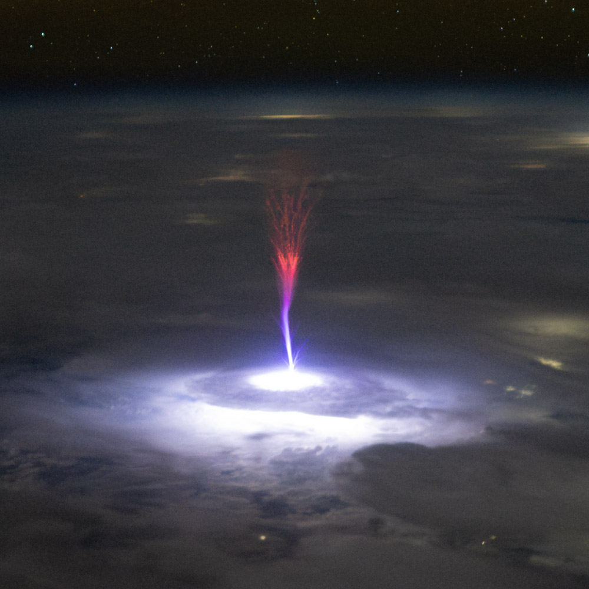](thumbnails/crop/iss073e0281502.jpg "Full resolution will be uploaded to Flickr") |  | TLE Type: gigantic_jet    Astronaut: Nichole Ayers | [Full resolution](https://eol.jsc.nasa.gov/DatabaseImages/ESC/large/ISS073/ISS073-E-281502.JPG)    [Request Raw](https://eol.jsc.nasa.gov/SearchPhotos/RequestOriginalImage.pl?mission=ISS073&roll=E&frame=281502&file=iss073e0281502.NEF) |
| [ISS073-E-317753](https://eol.jsc.nasa.gov/SearchPhotos/photo.pl?mission=ISS073&roll=E&frame=317753 "Link to the image listing") | [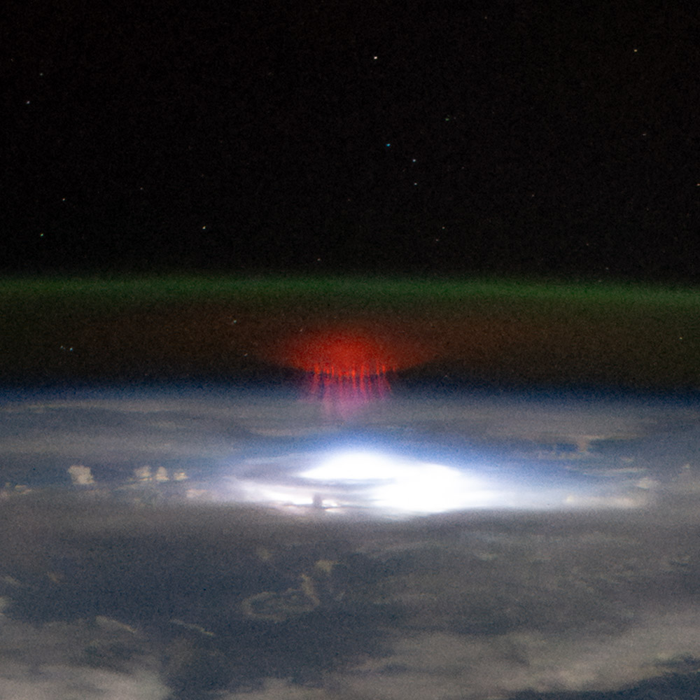](thumbnails/crop/iss073e0317753.jpg "Full resolution will be uploaded to Flickr") | [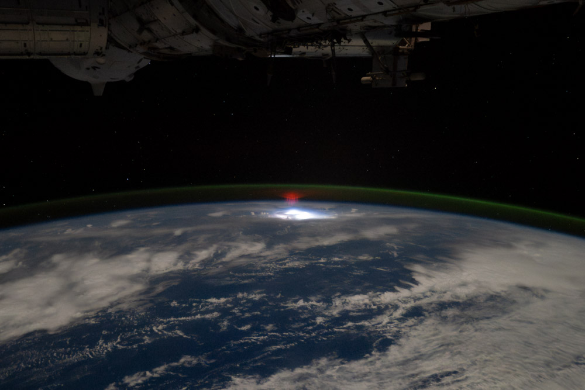](thumbnails/edit/iss073e0317753.jpg "Full resolution will be uploaded to Flickr") | TLE Type: sprite, halo    Astronaut: Nichole Ayers | [Full resolution](https://eol.jsc.nasa.gov/DatabaseImages/ESC/large/ISS073/ISS073-E-317753.JPG)    [Request Raw](https://eol.jsc.nasa.gov/SearchPhotos/RequestOriginalImage.pl?mission=ISS073&roll=E&frame=317753&file=iss073e0317753.NEF) |
